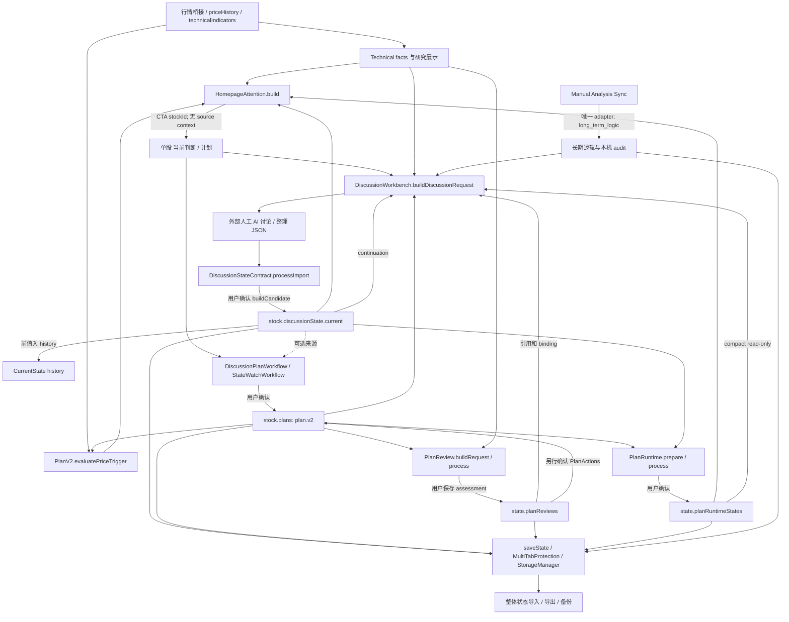
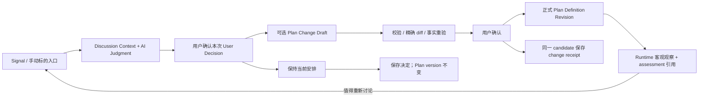
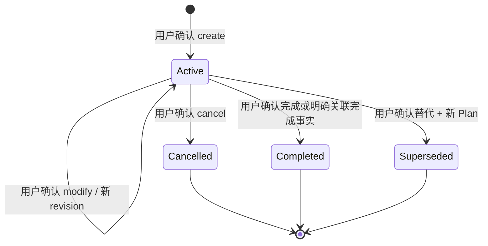

# Plan V4 + Discussion V4 Architecture Investigation

状态：**INVESTIGATION_COMPLETE**
调查日期：2026-09-08
权威仓库：`investment-workbench-mobile`
调查基线：`main`，HEAD `122be6d1bfd7b88dc0f93b6d1f9eb640cfd34c41`；开始时工作区干净。

本报告只调查和提出方案。唯一交付是本文档；未修改应用代码、schema、migration、prompt、测试、UI、CSS 或发布资产，未 commit、push、deploy，未访问生产账户或修改真实投资数据。用户提供的 Homepage production PASS 作为稳定上游前提；本次没有重新做 production acceptance。Management Category Lifecycle cross-zero option derivation 保持独立 **BLOCKED / deferred**，未调查根因、修改或重新验收。

证据说明：以下 `文件:行号` 均指上述 HEAD。区分「现状事实」「已复现边界」「建议设计」；建议中的对象名与枚举不是已实现契约，也不构成实施授权。仓库使用 JavaScript 工厂模块、运行时 validator 和 normalizer，未发现对应 TypeScript 类型作为另一份权威定义。本次未发现适用的仓库 `AGENTS.md`。

## 1. Executive Summary

**应保留 CurrentState、PlanReview 和现有 Runtime 数据，但重新明确它们所代表的含义。V4 的第一步应是统一定义投影、来源绑定及 freshness 契约，而不是先做复杂 trigger 或替换页面。**

1. 当前正式 Plan 是 `plan.v2`，存在两个 mode。`legacy_price` 混合长期定义、用户有效性、价格观察缓存和条件确认；`state_watch` 已明确保存长期观察纪律，并把动态阶段放进独立 Runtime。这是可以渐进演进的基础，不需要清空旧 Plan。
2. 当前 Discussion 是上下文准备、外部人工 AI 讨论、结论导入和确认保存的工作流。真正持久化的是 `stock.discussionState.current/history` 中的 CurrentState，并没有与之独立的完整 Discussion 会话档案。
3. V3 的 `currentState.userDecision` **由 AI 输出**，用户确认的是整份结论的保存。它是面向用户的仓位判断，不是独立、可审计的「用户决定继续等待／准备修改计划」事实。V4 不能把历史字段直接改名后宣称已经有用户授权。
4. PlanReview 应保留为**针对精确 Plan 修订的 AI assessment**，可由 Discussion 发起或展示，也继续兼容批量复核。`likely_invalid`、`completed_candidate` 都不是正式取消／完成。其当前 `freshness=current` 只检查 Plan ID、version、snapshotHash，没有证据日期或持仓新鲜度检查。
5. 现有 `plan-runtime.v1` 仅服务 `state_watch`，phase 是用户接受的 AI 复核结论；ID、binding、revision、时间和保存行为才是程序事实。它不是现成的 deterministic trigger engine。V4 应在 Runtime 的概念内分开客观观察与接受的评估，不能把旧 `confirmed` 转成机器证明。
6. 已有 `discussion-plan-draft.v1` 支持 create/update/no_change/invalidate/complete，且有 Preview、Confirm、精确目标绑定与原子候选保存。应优先复用这条路径。它只处理价格 Plan，CurrentState 来源可选，尚未使用独立 User Decision。
7. 首页已经有统一 derived signal 模型。当前价格 signal 的 `source='plan_runtime'` 不代表读取了持久 Runtime；它实际调用 `PlanV2.evaluatePriceTrigger`。信号已有来源字段，但 CTA 仅传 stock ID，来源上下文在导航处丢失。未来补充入口上下文即可，不建立第二套首页或 Opportunity 系统。
8. 最高优先级的架构风险是绑定语义：共用 `planSnapshotHash` 漏掉 state-watch 规则，同时包含会随价格观察变化的旧 Plan 缓存；Runtime 入口又没有核验 CurrentState 对现实事实是否仍有效。本次通过纯内存合成探针确认这些边界，未修复。

产品边界保持：**投资信息记录 + AI 判断辅助 + 计划管理；PROGRAM OWNS FACTS / AI OWNS JUDGMENTS；用户拥有长期规划和最终确认权。**

## 2. Current Architecture

### 2.1 当前真实数据和调用关系



图中的「外部人工 AI 讨论」不是应用内聊天记录存储。Discussion 结论保存不会自动修改 Plan、PlanReview、Runtime 或 holdings。Runtime 也没有自动订阅 Discussion 后写回；用户另开精确 Plan 的「复核状态」。

### 2.2 核心证据索引

| 编号 | 代码位置 | 证明的契约／调用 |
| --- | --- | --- |
| E01 | `src/plan-v2.js:8–22,81,169–249` | schema、mode、价格 Plan 定义、版本、触发、freshness、候选保存 |
| E02 | `src/plan-v2.js:93–167` | state-watch Definition 严格校验、创建、同 ID 编辑、终止 |
| E03 | `src/plan-review.js:12–47,65–85` | Review store、snapshot/hash、批量评估、独立 Plan mutation |
| E04 | `src/plan-runtime.js:14–28,124–164,197–247` | Runtime v1、binding、prepare、preview、确认和 history |
| E05 | `src/discussion-workbench.js:12–35,93–132,174–220,292–333` | CurrentState v1/v2/v3、reference、context 和 continuity |
| E06 | `src/discussion-state-contract.js:18–20,60–124,126–233` | shared parser、语义校验、anchor、holding reconciliation、存储 |
| E07 | `src/discussion-plan-workflow.js:14–23,85–111,196–250,280–303` | 当前 Plan Draft Session、可选来源、操作和正式提交 |
| E08 | `src/state-watch-workflow.js:18–36,108–128` | state-watch 专用流程、完整规则内容额外保护 |
| E09 | `src/homepage-attention.js:15–49,53–103,114–214` | facts screening、CurrentState freshness、action mapping、Runtime 提示 |
| E10 | `src/ui-render.js:2187–2200,4845–4878,5020–5045,5058–5087` | 首页 CTA、准备 Discussion、确认结论与计划 |
| E11 | `src/state.js:2062,2077`; `src/price-refresh.js:216` | normalizer 接入、价格观察更新 |
| E12 | `src/import-export.js:15–37,44–79`; `src/storage/storage-validation.js:36–74` | 整体快照与导入校验 |
| E13 | `src/storage/local-storage-adapter.js:5–9`; `src/storage/storage-manager.js:15–58,229–250`; `src/storage/cutover-v1.js:142–179` | localStorage / IndexedDB authority、revision、draft 分支 |
| E14 | `src/manual-analysis-sync.js:41–161`; `src/manual-analysis-sync-cloud.js:23`; `src/long-term-logic-sync-adapter.js:43–60` | 手动 publish/apply、CAS、唯一长期逻辑 adapter |
| E15 | `supabase/migrations/20260904105937_manual_analysis_sync_v1.sql:1–24,40–55,80–108` | 云端只存最新模块、用户隔离、LTL allowlist、revision |
| E16 | `src/strict-ai-json.js:312–401`; `src/long-term-logic-contract.js:123–190`; `src/batch-technical-review.js:47–50,191–236` | 已共享 parser、模块专用 candidate/commit |
| E17 | `src/ui-render.js:1792–1816,5893–5903,7300–7336`; `src/plan-update-draft.js:18–32,46–108` | legacy parser 与旧 Plan Update Draft 独立流程 |
| E18 | `src/api/ai-api.js:4–36`; `src/long-term-logic-workflow.js:11` | AI transport 目前只允许 long_term_logic；可复用的 prompt builder |
| E19 | `src/stock-research-ui.js:2–17`; `src/workbench-navigation-ui.js:30–45`; `src/ui-render.js:2531–2561` | 当前导航、计划编辑器、删除实际转取消 |
| E20 | `src/state.js:1068–1084,1133–1182`; `src/v13-plan-engine.js:11–23,59–75`; `src/rebalance.js:11–17` | 技术程序计算、历史触发阈值与 display grouping |

### 2.3 Authority 与保存位置

| 对象 | 当前 authority / 保存位置 | 是否另一份独立数据库对象 |
| --- | --- | --- |
| 正式 Plan | `state.stocks[].plans[]` | 否；canonical whole-state 的一部分 |
| 最新／历史 CurrentState | `stock.discussionState = {schemaVersion,current,history}` | 无独立 Discussion collection |
| PlanReview | `state.planReviews.currentByPlan/history/snapshots` | canonical whole-state 分支 |
| state-watch Runtime | `state.planRuntimeStates.byPlanId` | canonical whole-state 分支；不是自动监控表 |
| Discussion prepared context / 新 Plan draft preview | `ui-render.js` 的 Map、局部 preview；部分工作流用 WeakMap/WeakSet | 会话内对象，刷新后不能作为原确认上下文继续使用 |
| 旧 Plan Update Draft | `StorageManager.getDraft/saveDraft('plan_update',requestId)` | 独立 draft bucket；有 localStorage / IDB 适配 |
| Homepage Signal | `HomepageAttention.build` 返回值 | 纯派生，不保存、不调用 AI |
| Manual Sync revision | 云端最新 module row；本机 applied metadata | 不等于 Plan revision，也不是完整历史 |

`stock.tradePlan`、`coreModel`、旧 `decisionRecords/decisionStates`、AI Decision Review bridge 仍有兼容读路径；不应被当成下一代正式 Plan 或 User Decision 的同义 authority。`normalizeV13Plan` 在 `src/v13-core-model.js:123–124` 已委托 `PlanV2.normalizePlan`，说明可以继续用 adapter 收敛旧读者。

## 3. Current Plan Model

### 3.1 legacy_price

正式 schema 仍为 `plan.v2`；没有 `planMode` 的旧对象按 `legacy_price` 解释，显式非法 mode 不回退。主要字段如下。

| 类别 | 字段／现状 |
| --- | --- |
| 身份 | `id`, `schemaVersion`, `planMode`, `planVersion` |
| 意图与数量 | `action` 常用 buy/add/sell/reduce/observe；`quantity` 正数或 null |
| 单价条件 | `triggerPrice`, `triggerDirection = above/below/null` |
| 长期约束 | `conditions` 七类；`allocationConstraint.maxPositionPct/targetWeightRange`；`validUntil`, `nextReviewDate`, `note` |
| 正式状态 | `status = active/completed/cancelled/replaced` |
| 有效性 | `validityStatus = active/needs_review/invalid/completed`，以及 `invalidationReason` |
| 混入的观察／确认 | `priceTriggerStatus`, `triggeredAt`, `fullConditionStatus`，各 condition 的 `status` |
| 审计 | `createdAt`, `updatedAt`, `lastReviewedAt`, `terminatedAt`, `source`, `legacy` |

`conditions` 中的类别为 technical/fundamental/catalyst/allocation/market/invalidation/other；条目保存文本和 unconfirmed/confirmed/not_applicable。它不是可执行规则树。`fullConditionStatus=confirmed` 是已有确认数据，不能从价格触发推导。

`normalizeAction` 有历史语义折叠：除原始 buy 外，build/increase/建仓等会归成 add；profit_take 归 reduce，trend_defense/risk 归 observe。当前 canonical price action 没有独立 take-profit/stop-loss 目标。V4 迁移不能靠原 note 或当前 shares 猜测重建其原始意图。

### 3.2 state_watch

同一个 `plan.v2` 壳中的 `planMode='state_watch'` 已包含：name、applicableConditions、entryConditions、confirmationConditions、invalidationConditions、reviewAction、priceReferences、allocationConstraint、note、validUntil、nextReviewDate。

规则是受长度和条数约束的字符串数组。`reviewAction` 是 reduce_review/add_review/hold_watch/risk_control；没有专门 entry_review。`priceReferences` 可表达 reference 单价或 watch_zone from/to，但只表示参考含义，不带 price crossing／buy/sell 执行契约。

严格正式观察 Plan 要求 action/triggerPrice/triggerDirection/quantity/triggeredAt 为空，priceTriggerStatus=unavailable，fullConditionStatus=unproven，旧 conditions 不含实际条目。validator 还拒绝部分「今天已触发」一类当前状态文本。**因此 state-watch 已实现 Definition 与 Runtime 的结构分离；不能说整个系统仍完全混合。** [E02]

### 3.3 IDs、版本与多条计划

- 新建一般产生随机 Plan ID；无 ID 的 legacy 对象用原对象稳定序列化的 hash 产生 `legacy_*` ID。并非按 symbol 生成，也没有 sharesVersion。
- 普通价格编辑和 state-watch 编辑均保留 ID，实际定义变化才增加 planVersion；价格观察不增加 planVersion。价格 reconfirm 和终止也增加 planVersion，因此当前版本号不是纯 Definition revision。
- DiscussionPlanWorkflow.update 却把旧 ID 标记 replaced，再创建新 ID/version 1；通过 `legacy.discussionPlanSource.replacesPlanId/replacesPlanVersion` 连接。这与普通编辑的「同 ID/version+1」不一致，但必须兼容。
- 多条价格 Plan 是独立对象。`planDisplayEntries` 的 root/slot/编号仅沿 replacement 链保持展示名称；`v13-plan-engine` 的 group Map 是按 action 选展示代表，不是 planGroup 或 tranche。未发现约束下一档激活的 parent/sequence 模型。不能仅因「加仓计划 1/2/3」认定存在分批策略。

### 3.4 Editors、导入与删除

| 入口 | 实际写入方式 | 限制 |
| --- | --- | --- |
| 标的普通编辑器 | `collectPlans` → createPlan/applyAuthoritativeEdit；移除行转 cancelled | 价格与数量旧式编辑；state-watch 保留只读；动作不可在普通编辑改写 |
| Discussion 整理计划 | DiscussionPlanWorkflow.process → Preview → commit | legacy_price；零持仓 buy、有持仓 add/reduce/sell；未解决项阻止确认 |
| state-watch 专用入口 | StateWatchWorkflow → create/edit/terminateWatchPlan | 完整规则内容保护、精确目标、显式 confirmed |
| PlanReview 操作 | review snapshot 保存后，用户另行 reconfirm/invalidate/complete/edit | AI suggestedChanges 只是文字，不直接 apply |
| 旧 AI Refresh / tradePlan 导入 | `ui-render.js:940,3922` 周边兼容流程 | 另一组候选／转换路径，不等于当前 Discussion import |
| 旧 Plan Update Draft | plan_update draft bucket → 用户二次确认 → Plan candidate | proposed_plans、archive/delete 建议；后者落 replaced，未直接硬删除 |
| 整体备份导入 | normalize → validate → critical save | 整体 replacement，不是按 Plan 合并 |

旧资料 normalizer 保留部分原始时间和未知字段于 `legacy.originalTimestamps/originalFields`；migrated legacy 常标 needs_review/historical_only，缺失明确 direction 或配置前提不会变成可执行价格计划。旧 AI 时间戳不被自动提升为可信新时间。[E01, E17, E19]

## 4. Current Discussion Model

### 4.1 Discussion 与 CurrentState 的实际关系

当前最新契约为 context `stock-discussion.context.v3`、state `stock-discussion.state.v3`、store `stock-discussion.store.v1`。`sourceDiscussionVersion` 是上下文 preimage 的 `discussion_v3_*` hash 标识，不是一个独立会话的递增版本，也不是用户确认记录 ID。

`buildDiscussionRequest` 组合已有 CurrentState、持仓、技术锚点与增量日线、有效 Plan、PlanReview 引用、compact Runtime、长期逻辑、变化的支持资料和可选 market risk。用户去外部 AI 讨论，再用 archive request 整理 `{currentState: ...}` JSON。`processImport` 校验后，用户确认保存；程序生成 stateId、confirmedAt、confirmedDate、technicalSnapshot、references。上一 current 进入最多 30 条 history。[E05, E06, E10]

不是「一个 Discussion 对象包含多个 CurrentState」的数据库关系：目前没有独立 Discussion 对象。一个 preparation 可支持外部多轮交流，但正式保存结果只有一个 current；再次保存生成另一条快照。同日允许多个，历史不是按日覆盖。无法据本地结构还原完整外部对话。

### 4.2 AI 输出与 userDecision

AI 结果包含 symbol/sourceDiscussionVersion 的只读回显，以及 userDecision、actionAssessment、attentionLevel、trendAssessment、structureAssessment、stage、focusPoints、summary、keyChanges、risks、watchPoints、planRelation、confidence。

V3 userDecision 含 headline、holding、positionDirection、addAssessment、warning、takeProfit、stopLoss、riskSource。它和旧 actionAssessment 同时保存，并做部分矛盾校验。例如零持仓 holding/takeProfit/stopLoss 必须 not_applicable；有持仓必须回答 holding risk。第一层精确价格、股数、比例和日期禁由 AI 重述；市场归因必须有显式市场输入；确定性执行指令、肯定「完整条件已满足」等会失败。

**确认保存只说明用户接受归档这份 AI 判断。** 当前没有单独的「用户选择 wait/hold/review reduction」「用户拒绝 AI 建议」「用户授权创建某草稿」及其 actor/timestamp/result 对象。不能把 `userDecision.positionDirection` 当作用户执行意图，更不能作为交易授权。

### 4.3 三层保护

1. **Strict import**：Discussion 与 Plan Draft 都复用 StrictAiJson；schema allowlist、enum、内容边界由模块 validator 负责，parser 不负责投资含义。
2. **Protected context**：symbol、技术 anchor、holding、Plan reference、PlanReview reference、compact Runtime、marketRisk、长期逻辑进入 protectedSnapshot；CurrentState ID 和 research readiness/fingerprint 参与 source binding。证据或计划变化需重新准备。
3. **Holding reconciliation**：手动会话可在可证明只变化 shares 时要求用户确认已告知 AI，并按当前 shares 再做语义校验。它比较完整 preimage，只移除 shares，其他变化仍 hard block；预览后再变动仍重验。没有已验证 preimage、API transport 或其他事实变化不能借此放宽。[E06]

技术资料不足可以继续讨论，但保存连续 CurrentState 必须有合法完整日K anchor、正 close、匹配日期。不能为了记录一个 Plan 草稿而绕过 CurrentState anchor guard；无 CurrentState 的计划整理已经有独立受保护基础事实会话可用。

### 4.4 已有 Plan candidate 雏形与断点

`discussion-plan-draft.v1` 已足够作为 V4 起点：draftSessionId/version/hash、symbol、targetPlan 的 id/version/hash、operation、完整 plan、reason、risks、unresolvedItems。无 CurrentState 也能 prepare；有 CurrentState 时只附可选 provenance，且 compactCurrentState 仍主要取技术/actionAssessment 等字段，没有带上 V3 userDecision。新的 CurrentState 不会自动令 Plan Draft 失效，因为 draft authority 主要是当前 holdings/Plan，而非每日判断。[E07]

create/update 要求明确 trigger 或 condition、invalidation、买入配置前提、合法数量；update 不能改变增／减方向；state_watch 不允许走此入口。no_change 的全局无结果与精确单 Plan 保持不变已经区分，均零正式写入。

现状并非「Discussion 完全不改 Plan」：**保存 Discussion CurrentState 不改；用户另走 DiscussionPlanWorkflow 并确认，会改正式 Plan。** 这两种 confirmation 必须继续分开。

另有旧 `PlanUpdateDraft` 从 AiDecisionReviewReader 的 plan_update request/outcome 获取 source_decision_id。它是真实的旧链路，而非当前 V3 userDecision；可以参考其 draft 持久化和 application receipt，不能直接复用旧 action enum、数量导向 schema 或其 source ID 作为新 Discussion ID。[E17]

## 5. CurrentState / PlanReview / Runtime Relationships

### 5.1 三种 freshness 不能混为一谈

| 名称 | 当前计算 | 不代表什么 |
| --- | --- | --- |
| PlanV2.freshness | status/validity、validUntil、nextReviewDate、migrated legacy review 情况 | 不是 AI 证据新鲜度；日期经过仅派生 inactive/needs_review，不自动写 terminal status |
| Discussion.stateFreshness | symbol、锚点连续性、holding hash、plans、planReviews、长期逻辑 | 允许 anchor 后新增 bars；不是「今日首页可直接使用」 |
| Homepage judgmentSource | health current + Discussion continuity + 无新增 bars + technical reviewHash 未变 | 不意味着永远每天按时有结论；有效 quiet judgment 也压制 screening |
| PlanReview.reviewFreshness | Plan ID、planVersion、旧 snapshotHash 相同 | 未检查日历年龄、technical evidence、holding、research 更新 |
| Runtime.bindingStatus | exact Plan ID/version/hash + CurrentState ID/sourceDiscussionVersion | 未核验 CurrentState 与现在的 shares/技术事实是否仍连续 |

CurrentState 应保留为**当前可使用判断的兼容读模型**。V4 可以明确它是已确认 Discussion 结果的投影／引用，而不是另一个每天由 Plan 生成的对象。删除它会同时冲击首页、Runtime、history、Plan draft provenance 和旧备份，收益不足以抵消风险。

### 5.2 PlanReview

`plan-review.v1` 的核心是 reviewId、symbol、planId/planVersion/planSnapshotHash、reviewDate/reviewedAt、reviewOutcome、priceTriggerStatus/fullConditionStatus 的当时快照、programPremiseFacts、changedPremises、riskFlags、suggestedChanges、summary/confidence/source。

批量输入最多 12 个标的，按 expectedPlans 精确校验每个 Plan ID/version 一次，不许增减。AI outcome 为 still_valid/needs_review/likely_invalid/completed_candidate。`buildReviewCandidate` 再确认 Plan 未变后只写 Review store；历史上限 240，批次 snapshots 上限 60。保存 assessment 不会把正式 Plan 标 invalid/completed。[E03]

Homepage 不直接用 reviewOutcome 产生动作。它通过 Discussion reference 的 stale 状态间接受 Review 变化影响；PlanReview 不是第五套 action signal engine。Discussion 当前收到的 PlanReview 内容主要是引用和 freshness 状态文字，而不是完整 changedPremises/summary；这是以后合并复核展示的接口缺口。

建议保留独立对象，但语义收敛为 `PlanAssessment`：可从 Discussion 或批量 review 产生，可指向 Discussion；binding validity 与 evidence freshness 分开，旧 record 无足够事实来源时显示 unknown/historical。`needs_review` 是评估建议或派生复核需要，不能自动写成 official cancelled。

### 5.3 Runtime

当前 store=`plan-runtime.store.v1`，record=`plan-runtime.v1`，按 planId 一条 current record，history 最多 30。phase 为 inactive/watch_zone/forming/confirmed/action_review/resolved/downgraded/invalidated；transitionAssessment 为 advance/hold/downgrade/invalidate/resolve/unclear。

程序拥有：planId、runtimeRevision、sourcePlanVersion、sourcePlanSnapshotHash、sourceCurrentStateId、sourceDiscussionVersion、updatedAt、history 序列、fromPhase、committedAt、action_review acknowledgedAt、bindingStatus 推导和保存。

AI 提议：suggestedPhase、transitionAssessment、summary、evidence、watchPoints、risks、confidence。用户确认后，它们成为**已接受评估的记录**，不因此变成客观技术事实。`resolved` 不会完成 Definition，`invalidated` 不会取消 Definition，`action_review` 不会创建 orders/trades/quantity 或改变 shares。[E04]

Plan 更改保留旧 Runtime 和 history，派生 definition_changed；CurrentState 更改派生 current_state_changed；Plan 消失派生 missing_plan，不按 symbol/列表位置重新绑定。完全相同且 binding current 的复核为 no_change，零写入、零 revision 增量。

Runtime 与 PlanReview 的重叠在「原前提是否仍成立」「风险及观察点」「可能失效」；区别在 Runtime 是一个观察 episode 的进展，而 Review 是长期规划仍否适用。未来应共享证据引用和 freshness，不把两个 enum 合并成一个“大状态”。

### 5.4 History 与 audit 完整度

| 历史 | 当前可追溯内容 | 缺口 |
| --- | --- | --- |
| Discussion / CurrentState | current + 前 30 条快照，含确认时间、锚点、refs、AI judgment | 无完整对话、独立 User Decision、source Signal |
| Plan changes | Discussion update 的 replaced 旧对象 + 新对象关联；其他入口可能同 ID 覆盖 | 无统一 revision ledger；原地编辑旧字段无法仅凭当前 Plan 完整还原 |
| PlanReview | currentByPlan + history 240 + snapshots 60 | 不是完整输入证据快照，时间旧也可能标 current |
| Runtime | 每 Plan 30 条 from/to、binding、判断、确认时间 | 无逐行情客观 trigger history；不应为每根 K 线制造无限记录 |
| 旧 Plan Update Draft | draft/request/decision/application 元数据 | canonical Plan save 与 draft receipt 保存是两步，可能出现计划已改但 receipt 未更新 |
| Manual Sync | 云端递增 revision + 最新 payload；本机 applied revision/hash | 服务端没有逐 revision history 表；本机 LTL audit 不等于云端全历史 |
| 整体备份 | 导出时的 canonical state | 不等于事件日志；`alpha3ExportSnapshot` 不显式打包独立 plan_update draft bucket |

## 6. Homepage Signal Integration

首页是稳定上游，本报告不改变筛查公式、优先级、quiet suppression、有效性门槛或原有 CTA 语义。

### 6.1 当前两个 Plan 路径

1. **价格 screening**：在无有效 CurrentState 时，从正式有效 legacy_price Plan、完整日K close、当前价格一致性出发调用 evaluatePriceTrigger。仅 triggered 产生复核动作，near 不产生 V1 action。shares>0 的 buy/add → 加仓、sell/reduce → 减仓；shares=0 只有 buy → 建仓。无 Plan 的技术机会不生成 entry/add。
2. **state-watch Runtime 提示**：读取保存的 AI phase，核验 binding、CurrentState 和技术 health，已有 CTA 是「查看计划」。需要重核 binding 时提示原计划确认。它不是客观价格 signal 路径。[E09]

无 Plan 时，已有 program-owned 技术风险 conjunction 可导向 Discussion；已有有效 AI CurrentState 也可映射 action。技术筛查条件为持仓、日期一致、完整 close、`close < MA20 < MA60` 且 MACD histogram < 0；不能拿 technicalReview prose、support “企稳”判断、riskFlags 或混合 compactTechnical.currentJudgment 造新的买卖动作。

### 6.2 可复用的 signal context 与当前断点

临时 screening signal 已带 `symbol/source/signalType/requiresDiscussion/sourceAsOf`；price signal 另有 `planId/planVersion/planAction/triggerStatus`。最终 item 有 causes 诊断数组。`source='plan_runtime'` 是既有首页来源标签，不是「该 signal 必有 planRuntimeStates 记录」。

`ui-render.js:2190–2193` 只按按钮 action 和 stockId 调用 `openStockDetail(id,'ai')` 或 `'plan'`；随后 `startStockDiscussion` 重新 build context，没有 sourceSignal 参数。因此「今天为什么点进来」未形成可靠、可回溯输入。

**最小未来接入**：在既有 item/CTA 与 Discussion prepare 之间增加可选、程序构造的入口快照，含 source、reasonCode、observedAt/sourceAsOf、exact Plan ref（如有）、trigger ref／evidence ref、symbol。点击只导航，开始讨论时重新核实事实；过时原因保留作“进入时原因”，不能仍宣称当前触发。可选参数缺失仍允许从单股开始。

未来 Runtime 客观结果转换为同一 HomepageAttention candidate shape，由现有去重、排序、健康度和 quiet suppression 控制。不得把旧 Runtime phase 冒充 machine trigger，不增新的 Signal store、首页列表或自动 AI。state-watch 当前「查看计划」入口保持兼容；将来若新增“就此触发讨论”，须携 exact Plan ref，而非只按方向猜目标。

## 7. Ownership Analysis

`persist` 表示应用程序负责执行保存，并不意味着程序可以自行决定所有内容；用户确认后的 Plan Definition 是 user-owned persistent facts。AI 返回 IDs/hash 等仅是校验所需回显，不能重新产生 authority。

| Object / Field | Program | User | AI |
| --- | --- | --- | --- |
| symbol、stockId、Plan ID、revision/hash | 生成／校验／read／persist | 选择标的或计划 | read、必要时精确回显；不得生成权威身份 |
| canonical holdings/shares/cost/current price、日期、daily K、指标事实 | 接收可信记录、derive、read、persist | 录入／核对真实持仓及操作记录 | read；不得 write holdings/trades/orders |
| managementCategory | 校验并保存显式管理选择 | read／选择／confirm | read-only；Plan/Discussion 无改类权限 |
| Plan action intent/规则/价格区间/配置约束/失效规则 | 校验完整性、约束和版本；confirm 后 persist | read／edit／confirm，长期规划所有者 | read／propose draft；不得直接覆盖正式定义 |
| 客观 Trigger observation | 依规则与新鲜事实 derive | read，决定是否讨论 | read／解释；不得改其 true/false/unknown |
| Current Judgment，包括现 V3 userDecision | 绑定证据、validate、按确认 persist | read、接受归档／拒绝／提出不同判断 | propose AI judgment |
| 新独立 User Decision（建议） | 生成 decisionId/time、验证引用、persist | 作出决定、confirm、补充理由 | read；可建议选择，不能伪造用户确认 |
| PlanReview / accepted Runtime assessment | 验证、绑定、派生可用性、persist | read／确认保存 | propose assessment；不触发正式生命周期 |
| Draft（create/update/cancel/supersede/complete） | 精确 diff、冲突检查、生成确认 receipt | inspect／edit／confirm／discard | propose；complete 也只能是 candidate |
| Plan lifecycle 的 cancelled/completed/superseded | 仅依明确 user/program event 落状态 | 最终 confirm | 不得自行决定 |
| protectedSnapshot/sourceSignal | 从可信来源 build／derive，确认前重验 | read，说明本次目的 | read，不得伪造 evidence/source |
| Manual Sync envelope | hash/CAS/transport/验证；显式操作才 persist | publish／apply confirm | 无自动发布或应用权限 |

现有技术支持位数组或 CurrentState `structureAssessment.source='program'` 不能仅凭字段名获得程序 authority；须追溯具体计算函数、数据口径和覆盖。AI 结构条目即使回显 source 也不应成为新机器 trigger 的事实入口。

## 8. Identified Problems

严重度定义：critical 指扩展闭环前必须消除的 authority／绑定风险，并不声称已发生生产数据损坏；important 指当前明确语义债务与功能缺口；optional 指可延期能力。

### 8.1 Critical

**C1 — 同名 Plan snapshot 并非完整 Definition binding。**

`PlanReview.planSnapshot` (`src/plan-review.js:34`) 只投影旧字段，未包含 planMode、name、applicable/entry/confirmation/invalidationConditions、reviewAction、priceReferences。保持 id/version 不变而改变 entryConditions，两对象均能通过 Plan validator，snapshotHash 相同。相反，价格 observePriceTrigger 改 priceTriggerStatus，planVersion 不变但 snapshotHash 改变。

影响：PlanReview 与 `Runtime.bindingStatus` 的“定义没变”结论不够完整，价格动态字段又会制造所谓“计划事实改变”。正常 state-watch 编辑会 version+1；StateWatchWorkflow 额外比完整 rules，Runtime 正在进行的 session context 也包含完整 Definition，能拦截很多会话期间变动。**缺口主要是持久 binding 和跨入口一致性，不能宣称所有编辑保护都失效。**

建议：增加版本化 Definition projection/hash contract，明确观察缓存排除、所有 Definition 字段纳入；旧 hash 保留算法标识和旧 reader，不能替换旧值后假装旧 assessment 绑定仍可信。

**C2 — Runtime 对“当前事实”的保护只到 CurrentState 身份。**

`usableCurrentState` 只 validateState，prepare 未检查 Discussion.stateFreshness、technical health 或 Plan active；contextFor 也没有实时 holding facts。纯内存探针中，无当前完整行情且 shares 100→0，Discussion freshness=needs_review，Runtime preview 仍可通过。bindingStatus 仍可能 current，因为 stateId/sourceDiscussionVersion 没变。[E04]

影响限度：这条路径保存的是 AI assessment，不会自动交易；首页还另有更严格 health/current guards。不能因此说首页筛查失效。但未来若直接把 Runtime 当 deterministic engine，就会放大错误 authority。

建议：在既有 Runtime review 入口加统一 applicable-current-context 判断；旧 CurrentState 可作 historical input，不能作为可确认的当前机器事实。不能用“shares 一变化就把 Plan 取消”解决。

### 8.2 Important

| 编号 | 问题／证据 | 最小后续方向 |
| --- | --- | --- |
| I1 | userDecision 名称与 authority 不符；本质为 AI 输出，缺独立用户选择 [E05,E06] | 新增明确 User Decision，历史字段保留为旧判断，不合成授权 |
| I2 | PlanReview freshness 不看证据；多年旧 review 同版本仍 current [E03] | 区分 bindingStatus / evidenceFreshness / assessment；无来源证据时 unknown |
| I3 | PlanReview 的 still_valid/likely_invalid、Plan validity、Runtime invalidated 与 CurrentState.planRelation 容易被视为同一状态 | 展示和读模型分轴；只有正式确认事件改生命周期 |
| I4 | 多套 Plan mutation：同 ID 编辑与新 ID replacement 并存；完整 revision ledger 缺失 [E07,E17,E19] | 新写入统一命令和审计；旧链按原关系兼容读 |
| I5 | 新 Plan Draft 对所有 active Plan refs 和精确 shares 做 hard binding；CurrentState reconciliation 的 shares 例外没有自动扩展到 Draft [E07] | 按具体数量／配置约束重验，而非机械复制 shares 特判；更改须专门回归 |
| I6 | source Signal 在首页导航处丢失；Discussion compact Runtime 不附完整 applicability，PlanReview 只给 refs [E05,E09,E10] | 单一入口 context + assessment freshness 标签，保留历史原因 |
| I7 | 两代 Plan Draft 与旧 single Technical import 有 JSON.parse/extractFirstJsonObject，容忍包裹和首对象截取不同 [E16,E17] | 统一 transport parser，保留专用业务 validator；不要新复制 parser |
| I8 | V1/V2/V3 CurrentState normalizer 是 allowlist；旧 reader 会丢新字段；Plan normalizer 同样不能假定保留 V4 [E01,E05] | reader 先行、能力门控、forward fix 和往返样本 |
| I9 | Plan source 只存部分 draft/session IDs；create/update 的 draft.reason/risks 未统一永久保存；no_change 零写不形成用户决策历史 [E07] | 最小 decision/change receipt；是否保持 Plan 不应再制造 Plan version |
| I10 | 旧 Plan candidate 与旧 draft application receipt 非同一提交，receipt 失败仅 console.warn [E17] | 新闭环将正式结果与确认 receipt 放同一 canonical candidate |
| I11 | imported Discussion/PlanReview normalizer 可能先过滤坏数据，再验证；Runtime 原始 branch 则先严格验证 [E05,E12] | 兼容阶段区分“缺失旧分支”和“存在但损坏”，先校验原始新契约 |
| I12 | Runtime 按全局 planId 查；普通 commit 校验全局重复，但整体 storage validation 逐 Plan，缺同等全局 collection 检查 [E01,E04,E12] | 统一导入身份校验，重复 ID 阻断／显式修复，不按首个匹配续绑 |

### 8.3 Optional

- PlanGroup/strategy/tranche：现无依赖语义；V4 首版延期，保留多个独立 Plan。
- 完整规则 DSL、多层 AND/OR、自动 AI 结构监控：延期；先完成有限 trigger 和 unknown 语义。
- 云端 Plan/Discussion 同步：独立工程，非本机闭环前提。当前 server allowlist 不支持，不能只注册 adapter 即宣称完成。
- 清理旧 coreModel/recommendation/PlanUpdateDraft UI：等兼容和流量入口证据足够后另做，不在架构调查中删除。

### 8.4 本次验证证据与边界

运行 16 个现有 Node 测试文件，退出码 0：plan_v2_foundation、plan_mode_compatibility、state_watch_definition、plan_runtime、plan_review_batch、discussion_workbench、discussion_plan_workflow、discussion_decision_layer、discussion_holding_reconciliation、discussion_anchor_guard、homepage_screening、homepage_action_signal、manual_analysis_sync、strict_ai_json_import、long_term_logic_contract、batch_technical_review。未修改测试，也未跑有生产写入或发布行为的脚本。

另外以现有模块构造纯内存合成对象，结果如下；探针没有调用保存或网络，未新增测试文件：

| 探针 | 观测结果 |
| --- | --- |
| state-watch 修改 entryConditions，保持 version | bothValid=true；sameHash=true |
| legacy price 更新观察状态 | sameVersion=true；sameHash=false |
| 2020 年的 PlanReview 绑定当前未变 Plan | reviewFreshness.status=current |
| Runtime preparation 后 shares 100→0，CurrentState 身份未变 | CurrentState schema valid；Discussion freshness=needs_review；Runtime preview accepted |
| 已保存合成 Runtime 所属规则被同版本更改 | bindingStatus=current |

相关既有测试验证了正常编辑增版、session stale 拒绝、30 条 Runtime history、明确人工确认、不写 holdings 和旧模式兼容；这些 PASS 不覆盖上述跨入口／长期证据语义，也不否定探针结果。本次没有重新运行全量 JS、Python、真实浏览器或 production acceptance；调查文档不作发布就绪声明。

## 9. Proposed Plan V4

### 9.1 Conceptual schema（仅建议）

```text
PlanRecord
  planId, symbol, schemaVersion
  activeRevisionId
  lifecycle: active | cancelled | completed | superseded
  lifecycleEventRef
  supersededByPlanId?                // 仅明确替代关系
  legacyRef?                        // 保留旧 mode/id/version/hash 及来源

PlanDefinitionRevision
  revisionId, planId, revisionNumber
  actionIntent: entry | increase | reduce | hold_watch | risk_review
  title, rationale
  triggerRules                      // 见第 11 节；有限、非 DSL
  positionConstraints               // holding premise, max pct, optional qty 等
  invalidationRules                 // 条件，不是当前已失效结论
  validUntil?, reviewDueAt?
  definitionHash, hashContractVersion
  confirmedAt
  source: user_manual | discussion_draft | legacy_adapter
  sourceDiscussionId?, sourceUserDecisionId?, sourceDraftId?

PlanRuntimeView
  planRef: planId + revisionId + definitionHash
  observation: per-trigger result + evidenceRefs + factAsOf + evaluatorVersion
  eligibility: applicable | blocked | unknown, reasonCodes
  acceptedAssessmentRef?            // 旧 state-watch phase 在此兼容呈现
  bindingStatus, evidenceFreshness

PlanAssessment
  assessmentId, exact planRef, sourceDiscussionId?
  assessment: still_valid | needs_review | likely_invalid | completed_candidate
  judgment, evidenceRefs, assessedAt, acceptedAt
  bindingStatus, evidenceFreshness  // 派生，不是 lifecycle

PlanChangeReceipt
  eventId, operation, priorPlanRef?, resultingPlanRef?
  sourceDiscussionId?, sourceUserDecisionId?, sourceDraftId?
  confirmedAt, reason, changedFields / small revision snapshot
```

以上拆分为概念责任，并不要求每个概念都新增顶层 store 或数据库表。首版可继续使用 canonical whole-state，在 Plan record 内保存修订和 receipt，再通过只读 accessor 暴露；正式存储布局须在实现契约任务中确定。

### 9.2 Definition、Runtime、Validity 的最小边界

- Definition 保存未来条件和用户约束；不保存今天 trendAssessment、触发结果、AI 置信度作为正式规则状态。价格区间的数值可以由 AI 提议，但必须标 draft，经用户确认才是正式规划事实。
- Runtime 客观 observation 从当前事实重算；不要每次 render 持久化。仅需审计的 trigger episode 或用户接受 assessment 才保存小事件。旧 `planRuntimeStates` 原样保留为 accepted state-watch assessment，不能批量转 triggered。
- Validity 拆开 formal lifecycle、日期／仓位等客观 applicability、AI validity assessment。仍 active 但 evidence unknown／review due 很正常，不必写 cancelled。
- `definitionHash` 排除 observation、review time、当前 shares；包含全部规划字段和明确 hash contract version。PlanVersion 的兼容值、纯 Definition revision、Runtime revision、Sync revision 各有意义，不混用。
- 新修改建议同 planId 增修订；supersede 明确创建新 Plan 并保留旧链接。旧 Discussion update 已产生的新 ID 保持原状，不重编号和合并历史。
- User Decision 来源允许空：用户可以直接手动建立长期 Plan；如果宣称“由某次用户决定建立”，该引用必须存在且真实确认，不能指向 AI userDecision 文本。

## 10. Proposed Discussion V4

### 10.1 Conceptual schema（仅建议）

```text
DiscussionSnapshot
  discussionId, symbol, schemaVersion, startedAt
  sourceSignal?                     // 程序构造，允许手动无 signal 开始
  contextRef / compactContext
    technicalAnchor, factsAsOf, holdingAtStart
    exactPlanRefs, assessmentRefs, protectedContextHash
  aiCurrentJudgment
    user-facing holding / direction / risks
    technical evidence, planRelations, confidence
    proposedPlanChanges?            // 候选想法，不能直接 apply
  userDecision?
    decisionId, confirmedAt
    outcome, note
    consideredJudgmentRef
    planDisposition?                // keep / propose change 等
    acknowledgedContextRef
  planDraftRefs[]
  legacyCurrentStateRef?

PlanChangeDraft
  draftId, draftRevision, status: draft | ready | applied | discarded
  operation: create | update | cancel | supersede | complete
  symbol, exactTargetPlanRef?        // create 才可无目标
  proposedDefinition?, reason, unresolvedItems
  sourceDiscussionId?, sourceUserDecisionId?
  baseContextRef, protectedConstraints
  confirmationReceiptRef?

CurrentState compatibility view
  latest accepted Discussion judgment / existing current
  stateId/sourceDiscussionVersion/technicalSnapshot/references
  legacy fields remain readable
```

`outcome` 最小可以表达「继续等待／维持当前安排／愿意复核建仓或增减仓／暂不接受建议」；最终 enum 由产品定义，不把它当订单指令，也不必涵盖交易执行细节。完整聊天 transcript 非首版要求；保存决策快照和必要来源足够。

### 10.2 真实路径上的闭环

无 Plan：沿现有 Homepage/Stock → DiscussionWorkbench → DiscussionStateContract 保存判断；新增独立用户决定后，按需调用已有 Plan Draft Session，prepare 使用事实与明确来源；Preview 展示完整 Definition/diff、约束和 unresolvedItems；Confirm 才提交 Plan + receipt。

有 Plan：现有 price trigger 或 accepted state-watch review 提醒 → 点击时携 exact Plan ref/source context → Discussion 判断与用户决定 → keep 或可选 update/cancel/supersede draft → 用户确认。keep 不改 Plan revision，但可以保存本次独立 User Decision。用户撤回讨论或拒绝草稿不动正式 Plan。

AI 可以在一次输出中提出拟修改内容，但前端仍须经过现有专用 draft validation/normalization/candidate，而不是在 Discussion import 中遍历 JSON 并 apply。Plan/Discussion/receipt 在需要闭环提交时使用同一 candidate，以支持 failed save 零部分成功；独立「仅归档判断」仍可单独提交。

### 10.3 两个页面的职责

| 页面 | 首要展示 | 引用展示 |
| --- | --- | --- |
| Plan | 跨天规划、触发条件、仓位约束、Runtime 客观观察、评估可用性、正式生命周期、修订来源 | 最近相关 Discussion/用户决定链接，短摘要；不再次编辑每日 judgment |
| Discussion | 本次进入原因、当前事实与资料、AI 当前判断、用户确认结果、待确认 Plan changes | 精确 Plan Definition/Runtime/Review 的上下文卡，不能成为第二份可写正式计划 |
| History | Discussion 决策快照、Plan change receipts、旧 Review/Runtime 历史 | 按真实引用关联，不补造缺失会话 |

避免同时在两个页面保存各自「当前操作建议」、各自 price trigger 真值、各自 Plan validity，或把 AI judgment 的 userDecision 与真正用户选择用相同标题呈现。技术／新闻／基本面／估值／长期逻辑仍是按需资料，不新增每日待办。

### 10.4 AI Analysis Engine 可复用边界

推荐依序 `buildPrompt → manual/API transport → StrictAiJson.parseStrictAiJson → module validator → module normalize → protected candidate → user confirm → existing critical save`。解析失败、schema 不符、上下文冲突都不触发自动修复数据或调用付费重试。

当前情况：

| 模块 | parser 与确认流程 |
| --- | --- |
| Discussion | DiscussionStateContract.parse 委托 StrictAiJson；自身负责 anchor/holding/语义与 candidate |
| 新 Discussion Plan Draft / StateWatch / Runtime / PlanReview | 均已委托 StrictAiJson，已有各自专业 validator；无需再造通用 JSON parser |
| Long-Term | LongTermLogicContract.process 委托 StrictAiJson；已存在 buildPrompt、candidate/commit，可参考 transport 与模块契约分离 |
| 批量 Technical | BatchTechnicalReview.parseAiBatchJsonInput 委托 StrictAiJson |
| 旧单股 Technical / 部分旧导入 | extractFirstJsonObject，可从混合文本中取首个合法对象；与严格契约边界不同 |
| 旧 PlanUpdateDraft | UI 直接 JSON.parse，再 validate，存独立 draft bucket |

StrictAiJson 支持受限的外围清理、完整围栏、可证明结构引号／下划线转义传输修复；不等于业务容错。未知字段、AI 写 facts、错误 symbol/hash 必须仍由模块拒绝。`JSON.parse(JSON.stringify(...))` 的 clone 和备份 JSON.parse 不是应统一的 AI parser 重复点。

`InvestmentApi.ai` 目前 taskType allowlist 仅 `long_term_logic`，不能声称 Discussion/Plan 已可接 API。未来应扩充已存在 transport/module registry，并保持同一手动和 API safe pipeline；本次不修改 API、prompt 或 parser。

## 11. Trigger Model

### 11.1 Price trigger 的复用范围

`evaluatePriceTrigger` 可完整复用明确 above/below 的 inclusive `>= / <=` 比较、distancePct、缺失信息 unavailable，near 默认 5%。`rebalance.planGap` 已委托它。单一 triggerPrice 不支持区间；watch_zone range 虽已有储存形式，但没有机器触发语义。旧 `checkPlanTriggerLevel` 另有 10%/5% 两档和 none/level1/level2，不应与 canonical near 混用。

最小新增是有限 typed rule：`price_gte`、`price_lte`、`price_in_range`，明确价格基准、区间边界、完整 bar、sourceAsOf、允许误差。当前 evaluate 只回答“现在条件满足吗”，没有前一状态；“价格进入 60–65”若严格指 edge transition，还要可靠前一 observation。首版若只支持 in-range 必须这样命名，不能声称已监测 crossing。

V1 首页完整 close 与 current quote 一致性门槛保持；未来行情频率／复权基准若扩展，须独立验收后接入，不能默默变成盘中自动提示。

### 11.2 Technical 的机器／AI 边界

| 想表达的条件 | 可被程序证明的部分 | 必须保留判断／不确定的部分 |
| --- | --- | --- |
| 支撑企稳 | 确定来源的参考价、close 与价位关系、连续 bar 数等显式规则 | “有效支撑”“企稳成功”及参考位的解释；AI 支撑文本不是事实 |
| 突破回踩 | 对明确数值参考位的突破／回落、收盘位置 | 突破真实性、有效回踩、后续确认 |
| 缩量回调 | 标准化 volume、同来源窗口均量和比例、显式 price 回撤 | 量价性质、洗盘／卖压消化推断；未知 HK 单位或 provider transition 不能判成功 |
| 趋势修复 | 给定窗口均线、MACD 数值和明确关系 | 多周期结构已修复、走势可持续等 |
| 趋势恶化 | 如现有 dated close/MA20/MA60/MACD conjunction | 是否应减仓、止损风险和长期逻辑破坏 |

`state.js:updateTechnicalDataFromPriceHistory` 可从 completeHistory 计算 MA、MACD、volume facts、supportPrice/resistancePrice；供给指标必须日期匹配。supportPrice/resistancePrice 是特定算法结果，不等于市场确认支撑。`technicalData` 同时存在手动、AI、旧字段，technicalReview、shortTermTechnical、riskFlags、结构解释和 `Discussion.technicalSnapshot` 都可能混合；不能按存储对象名称整体标成 machine_checkable。[E20]

**需要 machine_checkable / ai_review_required 的区分**，但它是 evaluation authority，不是笼统“技术／价格”分类。machine rule 引用明确 evaluator/version 和程序 facts；AI rule 保存用户希望复核的观察语义，客观前提只触发“需讨论”，AI 接受结论存 assessment，不覆盖机器结果。

### 11.3 最小组合，不做 DSL

```text
TriggerSet
  combine: all | any
  rules:
    {id, kind: price_gte/price_lte/price_in_range,
     evaluation: machine_checkable, parameters, priceBasis}
    {id, kind: technical_fact,
     evaluation: machine_checkable, evaluatorId, evaluatorVersion, parameters}
    {id, kind: technical_review,
     evaluation: ai_review_required, description, evidenceRequirements}
```

首版最多一层 all/any、小而固定的 rule 上限，不嵌套，不解析自然语言为规则。保留每一项 true/false/unknown 的结果和来源，不把缺数据当 false。

| 组合 | 客观结果建议 |
| --- | --- |
| all：全部 machine 条件 true | 客观条件 satisfied；仍需 Discussion/用户确认，非执行许可 |
| all：一个 false | not_satisfied |
| all：无 false，但存在 unknown/AI 未复核 | unresolved，不能标完整条件 satisfied |
| any：至少一个 machine true | 该客观路径 satisfied，可产生复核入口；其他 AI 判断仍只是 assessment |
| any：全 false | not_satisfied |
| any：无 true，存在 unknown | unresolved |

price AND AI technical 可在价格满足后派生 review_required；不得把 AI 旧 confirmed 当作机器 true。若产品允许“用户接受技术评估后认为组合条件具备”，另显示 acceptedAssessmentOutcome 和证据 freshness，维持 authority 区分。

## 12. State / Lifecycle Model

### 12.1 闭环与正式状态迁移





`watching/approaching/triggered/blocked` 是 Runtime 派生轴；`still_valid/needs_review/likely_invalid` 是评估轴；`invalidated` 在旧 Runtime 中是历史评估 phase。均不加入正式生命周期图。过期、仓位不适用或 AI 认为无效，可阻止当前使用、提示复核，不自动取消。

旧 `replaced` 映射到兼容视图的 superseded；无法找到 successor 时保留“替代对象未知”，不能造新链接。旧 validityStatus=invalid 可能来自取消或显式失效，不能一概声称已用户 cancel。completed 不能由“价格触发过”推导。未来若用实际交易记录完成 Plan，必须有明确 Plan-ref 和完成条件，不依据 shares 变化猜因果。

### 12.2 Holding 协调

| 情况 | 当前已知行为 | V4 最小规则建议 |
| --- | --- | --- |
| shares=0 新计划 | Discussion draft 只允许 buy；首页只有明确 buy 才可建仓提醒 | entry 适用；held-only increase/reduce 阻止作为当前动作 |
| shares>0 新计划 | draft 禁 buy，允许 add/reduce/sell，检查数量与配置 | increase/reduce 适用；entry 的已持仓状态需用户复核 |
| 清仓后旧 add/reduce | 首页抑制其买／卖 screening；未见这些 Plan 在此自动取消 | 保留 Definition，Runtime blocked(position_mismatch)，可建议取消／改规划，不自动改 action 或分类 |
| 建仓后旧 buy | 首页 held+buy 可以映射 increase；draft 新建 buy 却被禁 | 明确此现有不对称；旧买入语义保持 legacy adapter，用户迁移时确认是一次 entry 还是可重复增加，不能自动改旧首页 |
| shares>0 数量调整 | CurrentState freshness 改；Plan 不因 shares 自动增版；Draft session 当前会 stale | 若无具体冲突，更新 Runtime/提醒复核；有计划减量超持仓、比例超 cap 等证明才阻止应用 |
| holdings 未知／非法 | 新 draft 和 screening fail closed | Runtime unknown；不可伪装零仓，也不可正式终止 Plan |

始终遵守「状态变化不是错误；可证明冲突才是错误」。对于不含数量、不受变化后配置影响的 Plan，股份变动不是 Definition 失效证据。对于有数量／仓位约束的 draft，应重算适用性并让用户重看差异。不要将 CurrentState 手动 shares reconciliation 原样复制到所有写路径，也不要恢复 shares-version 强绑定。

managementCategory 不参与新 Plan intent 推断，也不允许由上述转换自动改变。当前 Plan/Discussion/Runtime 模块没有直接写 managementCategory；部分旧入口仍依赖 stock.type/role 展示和数量语义，属于兼容输入耦合，不代表授权改管理分类。此结论不涉及已 deferred 的 category cross-zero 根因。

### 12.3 Revision 与 freshness

新 Definition revision 使此前针对该 revision 的 assessment 非当前；保留内容与出处。没有 Definition 变化、只有新 bars/资料/shares，应变 evidenceFreshness/applicability，不增加 Definition revision。用户只选择 keep，不重写 Definition hash。

同 ID 的当前事实观察可以重复计算；若实际需要持久 trigger event，使用 `planRef + ruleId + evidence fingerprint + transition` 去重，不能按每次渲染或日期生成无意义历史。AI 评估确认生成 assessment revision/receipt；未确认不写 official state。

## 13. Compatibility & Migration

### 13.1 必须保留的真实生产兼容面

- `legacy_price`：缺 mode、缺 direction、未知 timestamps、历史 action alias、allocation premise 缺失；保留 source 和 originalFields，不凭新 schema 补造事实。
- `state_watch`：已存在 Definition、Runtime phase/history、同 ID revision；不能把 priceReferences 当机器 trigger。
- CurrentState V1/V2/V3：分别保留 string planRelation、技术结论、V3 userDecision；旧历史不补造 V4 user decision 或 source Signal。
- PlanReview V1 / Runtime V1：保留原 hash、版本和语义；不能重算 hash 后把历史评估强行变 current。
- Whole-state 浏览器持久化、IDB cutover、stale-tab、备份／导入／restore；读取旧缺分支可 normalize empty，但不得因此打开页面就批量写 migration。
- Manual Analysis Sync、旧 draft bucket、AiDecisionReview bridge、tradePlan/coreModel readers：逐个列入往返样本，不把同名 “plan” 当同一种 schema。

已完成的 V3 文档明确记载：pre-V3 reader 会移除 userDecision 并按 V2 保存；因此旧客户端“可加载”不等于“可安全再保存”。Runtime 文档记录旧 top-level-preserving normalizer 可保留新 runtime branch，但旧备份替换仍会移除不存在的分支。不能把 Runtime 的兼容结论推广到 Plan/Discussion 的 allowlist normalizer。

### 13.2 迁移原则

1. **先读后写**：先加只读 adapter 和版本识别，旧对象不原地改写；未知未来 schema 禁止参与可丢字段的保存，不能静默降级。
2. **避免同字段双 authority**：V4 新结构若侧置保存，必须通过 accessor 指定其 authority，旧 `stocks[].plans` 是兼容投影还是旧对象须明确。未升级 reader 时不要双写两份可独立编辑的 Plan。
3. **逐 Plan 显式迁移**：用户打开／编辑时预览 v2→v4 投影及缺失前提，再确认；无法可靠映射的 action/trigger 作为 legacy review item，不丢弃。
4. **保持身份**：保留旧 Plan IDs、replaced links、历史版本与原 hash。新 revision 的 algorithm/contract version 独立标识；不得将旧 hash 文本用新算法覆盖。
5. **确认边界原子化**：Plan revision + source decision/draft + receipt 用同一 canonical candidate；失败不出现一半已保存。独立存储的旧 draft receipt 继续读，不能隐式迁移成新来源证明。
6. **回退能力检查**：禁用 UI feature 可以；旧 client 若会丢字段则不能作为数据安全 rollback。先导出 V4-capable 快照，优先 forward fix。

### 13.3 回归矩阵与独立阶段

| 样本／动作 | 必须保持 |
| --- | --- |
| 无 mode 的 legacy Plan 打开、无关编辑、导出再导入 | 既有 id、历史字段、needs_review 语义；零隐式新 trigger |
| 正式价格 Plan above/below、near/triggered | 当前单价比较与首页筛查结果等价；不扩展执行权限 |
| state-watch + runtime/history | 原 phase/revision/history 不丢；Definition 更改才影响 definition binding |
| V1/V2/V3 CurrentState 的历史往返 | 不伪造 userDecision、真实 User Decision、sourceSignal；旧文本和 anchor 保留 |
| 两种旧 Plan update 方式 | same-ID revision 和 replacement 链都可追溯，目标匹配不按名称 |
| 新 bars、研究变化、shares 数量变化／cross zero | 区分 context/evidence/applicability；可证明冲突阻断，不自动取消 Plan |
| 全量 JSON restore、缺新分支旧备份、坏 branch | 缺失明确提示 replacement 影响；损坏 fail closed，不 normalize 丢弃 |
| localStorage active / IndexedDB active / stale tab / 保存失败 | 仍使用既有 authority；无半份 Plan/receipt，无意外切源 |
| Manual Sync LTL publish/apply | SHA256/CAS/显式 confirm 不变；Plan/Discussion 不被附带同步 |
| 旧客户端加载后保存 | 检测潜在字段损失；不以只读成功冒充 round-trip safe |

每一阶段只对其新入口／读模型做独立启用和回归，保留旧 reader；不能把“所有计划先迁 V4”作为新 Discussion 使用条件。

### 13.4 Sync 与 backup 的特别限制

Manual Sync 已有 moduleType/entityKey/schema/revision/SHA256/payload envelope、expected revision/hash CAS、发布后验证、apply 前云端／本机重验；值得复用。但浏览器仅注册 LongTermLogicSyncAdapter，服务端 validate_module_payload 也只允许 long_term_logic/long-term-logic.v2。扩展 Plan/Discussion 必须同时处理 adapter、server allowlist、refs、confirmation 与 schema capability，不是本次本机闭环必需。

云端只保存当前版本；若将来需要跨设备还原“为什么修改”，必须把必要 audit 包含在模块载荷或另设计 history，不能期待 revision 数字还原内容。未知模块／版本当前会返回 unsupported，是可复用的 fail-closed 行为。

整体 export 会包含 Plan/Discussion/Review/Runtime 等 state 分支，独立 draft bucket 和设备 sync metadata 不在 `alpha3ExportSnapshot(state)` 的显式打包范围内。新 draft 若成为必须恢复的工作成果，需在其实现阶段明确是否进 canonical state，以及备份格式如何携带，不能假定旧 backup 自动包含。

## 14. Risks

| 风险 | 后果 | 建议控制 |
| --- | --- | --- |
| 把现 Runtime 直接改名 deterministic Runtime | AI confirmed 被升格为价格／技术事实 | acceptedAssessment 与 observation 分开；旧数据原义保留 |
| 用 V3 userDecision 充当真实 user confirmation | 草稿甚至正式修改有伪造来源 | 新 User Decision 单独确认；历史标明 AI judgment |
| 新 hash 契约直接覆盖旧 hash | 历史 Review/Runtime 错误重绑或全部无差别失效 | hashContractVersion + legacy binding adapter + 不自动 rebase |
| 只靠 PlanVersion 判断可用 | 同版本内容缺口、证据陈旧或持仓不适用 | 定义绑定／证据新鲜度／适用性分轴 |
| 同时迁移 schema、parser、首页、云端、所有编辑器 | 无法定位数据损失，无法独立回归 | reader-first 小阶段；T1 不改正式 schema |
| 组合条件压缩掉 unknown | 缺数据或 AI 推断成为 true | 每规则 evidence、三值逻辑与 review_required |
| 为新闭环放松保护上下文 | 技术 anchor/长期逻辑/身份变化仍可 apply | 复用完整 preimage 重验，狭义 shares reconciliation 不泛化 |
| 所有状态变化都视为错误 | 再次产生 shares-version 过度绑定 | 有约束冲突才阻断；其他情况更新 Runtime/review |
| 审计 history 截断断链 | Plan 来源 ID 尚在，但 Discussion 快照已被清除 | receipt 保留必要小摘要与精确 refs；不能仅依 30 条 current history |
| source Signal 过时 | 进入时触发被误读为仍在触发 | source snapshot 与当前重新计算结果分别展示 |
| Category deferred issue 被混入 | 任务失焦或错误宣称 blocker 已清除 | 不调查、不修复、不让其阻塞本次完成 |

本报告没有读取生产浏览器 storage、云端真实 Plan 数据或账户；因此不能量化各旧版本的数据占比，不能证明所有用户备份都无重复 ID，也不宣称生产发生过 C1/C2。迁移前应另用用户授权的脱敏样本执行 round-trip 验收。本次读取已足以确定代码契约和风险，不需要以真实数据访问作为调查完成前提。

## 15. Recommended Implementation Phases

以下为后续 Codex Tasks 建议，**未创建、未执行**。风险低／中／高指实现影响面。

| 顺序 / Task name | Goal | Scope | Dependencies | Risk | 独立验收边界 |
| --- | --- | --- | --- | --- | --- |
| 1 / Plan–Discussion Shared Context & Binding Contracts V1 | 建立完整 Definition projection、旧 binding adapter、分轴 freshness/read model | 纯契约／accessor／测试，列出 consumer；无持久 schema、UI、首页、API 或迁移 | 本报告 | 中 | v2 price/watch、旧 CS/Review/Runtime 纯读兼容；明确 C1/C2；读取零写入 |
| 2 / Existing Assessment Freshness Guard V1 | 收紧现 Runtime 与 Review 的当前适用性，保留历史评估 | 精确入口 guards、未知证据显示、binding 版本兼容；不得自动改 Plan | Task 1 | 中高 | stale CurrentState、同版本规则变动、正常增版、新 bars/shares、failed save；原首页筛查基线不变 |
| 3 / Discussion V4 User Decision & Source Context | 建立真实用户确认快照与可选 source Signal 来源 | 兼容 V1–V3 CS reader；最小 decision persist；沿既有 CTA 接上下文；不改筛查公式 | Task 1；Task 2 的 context contract | 高 | 手动无 signal／无 Plan／旧历史不造授权；导航不自动 AI；用户拒绝/等待可记录 |
| 4 / Plan V4 Definition & Revision Compatibility | 提供新长期 Definition 和 revision/receipt，读旧模式 | 有限 intent/约束/trigger schema、旧 adapter、用户确认迁移；history 保留 | Task 1；source contract 对接 Task 3 | 高 | legacy round trip、mode 不混用、same-ID 与 replaced 链、rollback capability |
| 5 / Plan Runtime Objective Observation V1 | 建立 price observation 与 accepted assessment 分离 | 优先复用单价比较，再加入明确 range；facts/version/unknown；同一首页 candidate adapter | Task 2、4 | 中高 | 纯计算无写；当前首页 legacy 输出等价；AI phase 不成为 machine proof |
| 6 / Plan–Discussion Confirmed Change Loop V1 | 打通 Decision→Draft→Confirm→Plan revision + audit | 扩展现有 draft validators、精确 diff、keep/update/cancel/supersede/complete、原子 receipt | Task 3、4；触发回路需 Task 5 | 高 | create/update/no_change/拒绝/撤回/冲突/失败；holdings/category/trades/orders 不被改 |
| 7 / Shared AI Transport Adoption for Plan & Discussion | 手动与未来 API 使用同一安全解析和模块契约 | 新入口复用 StrictAiJson；旧 parser 分别受控迁移；API allowlist 独立接入 | 稳定 Task 3、6 contracts | 中高 | 手动/API 同样 schema/context rejection，无自动确认或付费重试 |
| 8 / Optional Technical Review Triggers V1 | 增加少量明确 technical_fact 与 ai_review_required | 单层 all/any、evaluator/version、标准化 volume；继续现有 signal 接口 | Task 5、6 | 高 | provenance、日期、unknown、AND/OR、负向／机会边界；不造无 Plan 机会系统 |
| Deferred / Plan Groups & Tranches | 在真实用户分档需求成立后再引入关联 | group metadata、预算／顺序需求需另立 brief | 稳定 Task 4–6 + 实际需求 | 中高 | 默认多个独立 Plan，不自动共享生命周期 |
| Deferred / Plan–Discussion Manual Sync | 跨设备显式同步与来源历史 | browser adapter + server schema allowlist + audit/CAS/backup compatibility | 稳定新持久 contracts | 高 | 不同步 holdings、trades、orders；各端预览确认；未知版本拒绝 |

每项应单独实施、独立回归和验收，不把整表变成一次大改。Task 7、8、云同步及 group 都不应阻塞最小本机闭环。

## 16. Recommended Next Task

**首个正式实现任务：Plan–Discussion Shared Context & Binding Contracts V1。**

原因：现有草稿和保存基础已经具备，最急需统一的是“我们正在确认哪一份 Plan，以及哪些证据仍可用”。直接先做 Plan V4 schema 或技术 trigger 会把 C1/C2 和多种 freshness 搬进新模型。先建立只读契约可独立验证，不要求迁移旧 Plan、改首页或接入云端。

建议下轮可直接使用的任务范围：

> 在 `investment-workbench-mobile` 实现共享 Plan/Discussion 只读 context 与 binding contracts。建立完整 state-watch/legacy_price Definition projection（排除动态 price observation）、带算法版本的 Definition hash、保留原 PlanReview snapshot hash 的 legacy adapter，明确 Plan binding、CurrentState evidence freshness、holding applicability 三个独立结果。提供现有所有 consumer 的接入清单与兼容测试。不得在本任务中迁移 production data、改变正式 Plan/Discussion schema、自动 rebinding 历史评估、修改 Homepage screening/action mapping、改管理分类、增加 API/AI 自动调用或部署。新 helpers 未接入全部旧路径前，不宣称 Runtime/Review 风险已经修复。完成后交付可独立回归的 contracts，为下一项 Existing Assessment Freshness Guard V1 提供基础。

### 16.1 必答问题索引：23 项明确结论

| # | 问题 | 结论 |
| --- | --- | --- |
| 1 | 当前 Plan 的真实职责 | price 模式混合 Definition/validity/价格观察缓存；watch 模式已是长期 Definition。见 §3 |
| 2 | 当前 Discussion 的真实职责 | 准备事实、外部 AI 讨论与 CurrentState 导入归档的工作流，非独立 transcript store。见 §4 |
| 3 | CurrentState 与 Discussion 是否重叠 | 是结果/容器语义重叠；应保留并明确为已接受判断的兼容读模型，非删除。见 §5 |
| 4 | PlanReview 是否独立保留 | 保留为精确 Plan assessment，可由 Discussion 或批量复核生成；不拥有正式 validity。见 §5.2 |
| 5 | Runtime 合理边界 | 当前是用户接受的 state-watch AI phase；未来分 objective observation 与 accepted assessment。见 §5.3、§9 |
| 6 | program-owned 字段 | 身份、事实、版本/hash、时间、客观计算和持久化机制；AI phase 不是程序事实。见 §7 |
| 7 | user-owned 字段 | 管理分类、长期 Plan Definition、真实用户决定与正式生命周期确认。见 §7 |
| 8 | AI judgment 字段 | 当前 userDecision/actionAssessment/结构解释、Review outcome、Runtime suggestedPhase/说明等。见 §4、§7 |
| 9 | AI 可 draft 但必须确认的对象 | 当前判断归档、Plan create/update/cancel/supersede/complete 候选、Review/Runtime assessment；User Decision 的确认不能由 AI 生成。见 §7 |
| 10 | 无 Plan Signal 如何进 Discussion | 现有 HomepageAttention → stockId → ai workspace；后续补可选 source context，不新增首页系统。见 §6 |
| 11 | Discussion 如何生成 Draft | 复用独立 DiscussionPlanWorkflow.prepare；接入新 User Decision 和精确来源，state-watch 用专用 validator。见 §4.4、§10 |
| 12 | 用户如何确认 Draft | 完整 Preview/diff、约束重验、未解决项清零，Confirm → critical candidate + receipt。见 §10.2 |
| 13 | 已有 Plan 触发如何讨论 | 价格已接现有 CTA；watch 当前经 Plan 页面，未来携 exact Plan ref 进入同一 Discussion。见 §6 |
| 14 | 讨论后如何保持/修改/取消 | keep 只记录决定；其余独立 draft+确认；当前 invalidate 实际 cancelled，V4 明确命令语义。见 §12 |
| 15 | price trigger 能复用多少 | above/below inclusive、distance、near、unavailable；range/进入事件需最小扩展，不能复用为完整技术条件证明。见 §11.1 |
| 16 | technical trigger 最安全边界 | 可追溯程序数据与显式 evaluator 才 machine；企稳、结构、买卖适宜性仍判断。见 §11.2 |
| 17 | 是否要两类 evaluation | 要；machine_checkable 与 ai_review_required，AI assessment 不覆盖 machine truth。见 §11.2–3 |
| 18 | Plan 与 shares 如何协调 | 保留 Definition；检查适用性和具体数量/cap 冲突，cross zero 引发复核而非自动取消或改类。见 §12.2 |
| 19 | version 与 Review freshness 如何绑定 | 精确 Definition ref 决定 binding；事实变化决定 evidenceFreshness，两者分开，旧 review 不自动 rebase。见 §12.3 |
| 20 | 旧 Plan 如何迁移 | reader-first legacy adapter、逐 Plan 用户确认、保留 ID/原 hash/原历史和 round-trip 能力。见 §13 |
| 21 | Plan 页面主要展示 | 长期定义、约束、Runtime/assessment 可用性、生命周期与修改来源。见 §10.3 |
| 22 | Discussion 页面主要展示 | 进入原因、当次事实和 AI 判断、真实用户决定、候选 Plan changes。见 §10.3 |
| 23 | 哪些不应两边重复 | 两份可写当前判断、两份 Plan authority、各自 trigger/validity 真值；以精确引用连接。见 §10.3 |

**完成状态：INVESTIGATION_COMPLETE。下一步仅为上述任务建议；本次停在调查文档，不进入 implementation、commit、push 或 deploy。**
