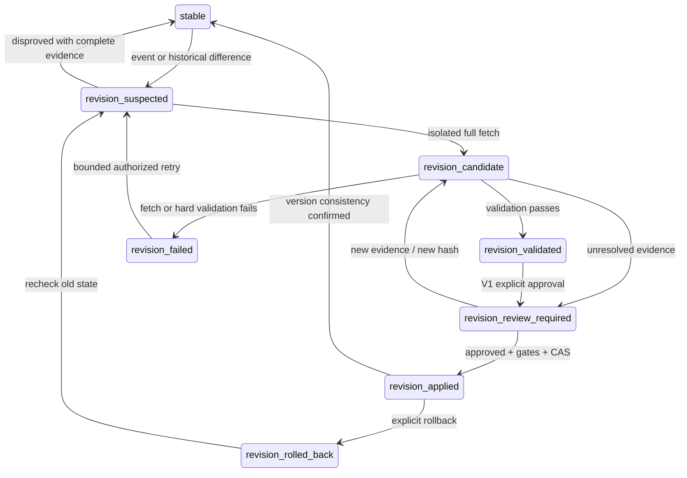

# PROVIDER_REVISION_POLICY_V1

日期：2026-10-04。类型：DATA GOVERNANCE / SAME-PROVIDER HISTORICAL REVISION POLICY。

**最终状态：REVISION_POLICY_COMPLETE_READY_FOR_IMPLEMENTATION。** 本文是设计规范，不是已实施能力、部署许可或数据审批。2899.HK 现有候选继续 **APPLY_BLOCKED**。本轮唯一新增交付是本文档；没有修改现有代码或数据，没有发起行情请求、Approve、Apply、数据库写入、push 或 deploy。

依据：前置 Provider Continuity Migration Policy、Rebase V1 实现及 [2899 Yahoo Historical Revision Audit](2899_YAHOO_HISTORICAL_REVISION_AUDIT_V1.md)。以下 MUST/必须为未来实现约束；“现有”单独标明，不能把拟议字段读作已经上线。

## 1. Executive Summary

采用 **同一通用候选模型 + 两类原因判断 + 一套版本/审批/回滚机制**。跨 provider 变化仍是 provider rebase；相同契约下的历史修订是 revision。两者均不得静默覆盖 current history。

核心决策：

1. same provider 不等于历史稳定；稳定性需要带观察时点和验证范围的证据。
2. 日常更新采用 **每次 overlap + periodic full verification + event-driven full refresh**。现阶段没有经校准的探测周期，保守实现默认在每次显式日更中核对完整保留窗口，不凭感觉定 N，也不新增 scheduler。
3. qfq 历史出现修订证据后暂停该 symbol 的增量提交，从固定 provider 重新获取完整 retained history，生成隔离候选；不能只覆盖 changed bars。
4. V1 **不允许任何历史 revision AUTO_APPLY**。允许按已授权更新请求自动检测/生成候选；用户仍须批准确定 hash。强 factor match 只是证据，不是审批。
5. 技术事实与 bars 作为同一版本提交；AI 判断 needs_review，历史 Discussion 保留。日期相同但历史内容不同必须产生不同内容版本。
6. 价格、量、额各自验证；不能用解释成立的价格修订掩盖孤立 volume 差异。
7. 精度政策使用确定性表示和独立内容 hash；不以降低小数位、百分比容差或忽略发生变化的字段消除真实 drift。

未知单位、事件覆盖或精度参数在本规范中有明确的保守阻断路径，不需要先猜出参数才能实施。政策完整不等于当前 pilot 已具备 Apply 条件。

## 2. 2899 Evidence

| 已审计事实 | 对 policy 的意义 |
| --- | --- |
| old Yahoo=374，candidate=426，common=374，OHLC changed=361 / unchanged=13 | 比较必须明确 provider 筛选和分母；52 个 candidate-only 日期原属 Eastmoney |
| 361 根来自 2026-07-13 的除息前抓取，13 根后来抓取 | 同源数据也会混入不同 adjustment observation states |
| changed close ratio 中位数 0.985518451040 | 长范围共同比例变化是复权假设证据，不是自动通过规则 |
| 7/23 除息，每股 HKD 0.4839736；1−0.4839736/33.42=0.985518444045 | 时间、币种、金额和因子可联合验证 |
| 同一 raw response 的旧新 parser 回放 426 根一致 | 未发现解析算法变更解释主要价差 |
| 373 根 volume 相同，10/2 减少 8000 原始单位 | 独立 volume 修订仍需验证 |
| 当前重抓与冻结候选最大差 0.000004 | 六位小数没有使跨次抓取完全稳定 |
| 原始旧 HTTP payload 不存在 | 因果判断置信度与直接 raw 对照证明必须分开 |

旧 updater 默认 latest−7 个自然日；初次/legacy 请求默认 550 天。Rebase 已改为读取整个既有保留窗口，但未 Apply。2899 保留窗口 2025-01-09—2026-10-02，426 bars；前次 raw 审计响应 47,530 bytes。一次成功请求及一次 Eastmoney timeout 不能给出 SLA、吞吐或合理轮询频率。

公司行动事实沿用已核实的 [公司官方公告](https://www.zijinmining.com/upload/file/2026/07/22/f1c55d0bc3694ba292f77119610ce771.pdf)；本次不重新调查或抓取行情。

## 3. Same-provider Revision Definition

在同一 owner/project/symbol/market/daily interval 的已完成历史范围内，满足以下条件时，定义为 **SAME_PROVIDER_REVISION**：

- canonicalProvider 未变；raw provider 身份仍属于已验证映射。
- adapter/parser/normalization/adjustment 实现语义兼容，有版本/回放证据；仅名称相同不算兼容。
- adjustment 类型、priceBasis、币种和单位契约未变。
- 重叠完成 bars 的一个或多个规范化字段发生变化，或历史日期集合发生可疑增删。
- 原因已确认为或可合理怀疑为公司行动、上游更正或历史重述；原因不足先记 UNKNOWN_REVISION。

检测不要求原因预先解释完整，否则会漏掉未知修订。只有未完成当日日 K 的正常变化不算本类，但它不能覆写先前已完成 bar；complete-bar 规则沿用现有逻辑。

| 情况 | 分类/处理 |
| --- | --- |
| canonical provider 不同，或旧 base 已混源 | PROVIDER_SWITCH / MIXED_BASELINE，走 provider rebase；不能伪装纯同源 revision |
| 相同 provider，价格处理算法/有效精度等语义改变 | PIPELINE_CHANGE，另证实现兼容性；未证明前禁止普通增量 |
| 币种、share/lot/scale 改变 | UNIT_CHANGE，独立校准；不能用统一 ratio 当 dividend |
| 非法 OHLC、日期重复、hash 损坏、负 volume 等 | DATA_CORRUPTION / INVALID_DATA，拒绝写入，保留旧版本 |
| 操作者修改历史文件 | MANUAL_EDIT，不能归因上游；走显式导入审计 |
| 只有新完成交易日，已验证旧窗口一致 | INCREMENTAL_APPEND，不是历史 revision |

观察数据变化、解释原因、判定可应用是三个不同结论。

## 4. Revision Types

| revisionType | 所需解释 | V1 审批 |
| --- | --- | --- |
| CORPORATE_ACTION_READJUSTMENT | 事件/边界/字段范围/因子或 provider 已验证调整模型相符 | USER_REVIEW |
| UPSTREAM_HISTORICAL_CORRECTION | 已有行情的具体日期/字段被更正；保留原、新响应，说明公开更正证据或未明之处 | USER_REVIEW |
| PROVIDER_DATA_RESTATEMENT | provider 成批重述历史，包括日期、数据覆盖或统计口径；范围明确，避免和单点 correction 混淆 | USER_REVIEW |
| PIPELINE_IMPLEMENTATION_CHANGE | 输入相同但本地输出语义改变，属于 pipeline 分支，不认定已满足“兼容同源” | USER_REVIEW，另需实现评审 |
| UNKNOWN_REVISION | 原因、兼容性或数据证据不足；不能自动选最像的解释 | USER_REVIEW；硬条件未满足时仍不可批准 |

允许一个 primary、多个 secondary causes，以及按字段的 causeAssessment/confidence/evidenceRefs。统一百分比变化不能排除单位变化或实现变化；一个价格事件解释不能自动覆盖 volume/amount/date 问题。

## 5. Corporate Action Model

事件概念字段：providerEventId（如有）、symbol、market、instrumentType、eventType、announcementDate、ex/effectiveDate、record/paymentDate（可选）、timezone、cashCurrency/cashPerShare、splitRatio、rightsTerms、sourceRefs、observedAt、revision/cancellation、evidenceHash。

事件日期必须区分公告日、除权除息生效日和支付日；缓存采用幂等事件键及内容 hash，更新/撤销事件也触发复核。不能把同一现金流的公告及付款重复计算为两个因子。

| 事件 | 可能影响 | 约束 |
| --- | --- | --- |
| cash dividend / fund distribution | adjusted 价格及依赖指标 | gross/net、每股/每10股、币种、provider 算法先确认；不用个人税率自算行情调整 |
| split / reverse split / consolidation | 价格、股数/volume 的 provider 定义可能变化 | 检查方向和比例；不能仅调整 OHLC 后假定 volume 不变 |
| bonus issue / stock dividend | 价格及份额基准可能变化 | 用对应市场及 provider 模型 |
| rights issue | 除权参考价可能依认购比例/价格改变 | 不套现金分红公式；条款不足转 review |
| capital distribution / special distribution | 价格或总回报口径 | 避免与普通 dividend 重复计算 |
| other / cancelled event | 影响未知 | 作为疑点触发复核，不自动 Apply |

A 股、港股、ETF 使用各自 instrument/market contract；ETF 分配、份额拆合与股票事件分别处理。当前 registry 支持 CN/HK daily，不因本政策扩展其他市场、分钟线或外部新闻/财报 API。

当前 Yahoo `events=history` 日更 adapter 不消费行动事件；前次只读 chart `events=div,splits,capitalGains` 取得 dividends，证明该 endpoint 具有有限可用能力，不证明事件完整。Eastmoney 当前 kline adapter 只读价格量额，没有行动流或因子流。**事件 API 不是系统工作的前置依赖**：没有事件信号时仍通过历史比较检测；无法解释的变化进入 review。

Registry 拟增最小能力（本次不实现）：

| 字段 | 含义 | Yahoo 当前证据 | Eastmoney 当前证据 |
| --- | --- | --- | --- |
| historicalRevisionPossible | 已知/可能/未知 | true | true（调整历史保守视为可变） |
| adjustedHistoryMutable | 按具体 adjustment 模式 | qfq/adjusted=true | qfq/adjusted=true |
| corporateActionSupport | implemented / observed_partial / unavailable / unknown + types | observed_partial，未接入日更 | 当前 adapter unavailable；上游能力 unknown |
| revisionProbeSupported | 可重新请求/比较哪些窗口 | daily history | daily history；可用性以请求实测为准 |
| adjustmentFactorSupport | 显式/可推导/无 | quote+adjclose 可推导 | 当前无 |
| normalizationVersion / precisionProfileRef | 数值规则及校准证据引用 | 现有六位规则，跨次漂移未校准 | 现有字段解析，单位契约未闭合 |

能力声明不等于稳定性证明，也不赋予访问账户数据或写入的权限。

## 6. Detection Layers

| 层 | 检查 | 输出与边界 |
| --- | --- | --- |
| L1 Corporate Action Signal | 已有 provider 事件、新增/更正/撤销、发生于当前 observation state 之后的生效事件 | trigger；仅有 signal 不代表已修订，空事件流不代表无修订 |
| L2 Historical Overlap Probe | 同契约重叠完整 bar 的日期/独立字段/可用 factor 比较，记录实际覆盖 | exact match、差异、缺失、探测失败分别报告 |
| L3 Ratio / Cause Analysis | 分析 OHLC ratio、区间、fetchedAt 分组、因子证据、volume独立差异 | 解释与置信度；不负责批准 |
| L4 Versioned Candidate Validation | 单源全窗口、单位/完整性/precision/技术差异、hash/approval/CAS | 可审阅不可批准 / 验证通过待批准 / 失败 |

已知 mixed baseline 在 L2 前即阻断普通增量，走已有 rebase。L1 无事件但 L2 有变化，一样触发 revision；L2 失败不能报告 stable。

## 7. Overlap Probe

不凭感觉新增“最近 N 天”。ProbePlan 由当前 retained range、最后成功 verified range、事件边界、adapter 能力、已批准的 freshness/detection-lag profile 生成，并记入审计。

在已校准的未来优化模式下，每次请求至少覆盖最新已完成 bar 及尚未验证的近端重叠区间；事件疑点还需覆盖事件前后的完整交易日，并选取已保存的较早 factor/price 样本。窗口下界是这些必需范围的并集，不以固定自然日数代替交易日/停牌处理。

Sentinel/sample 可以发现问题，但 **样本未变不证明未采样历史没有改动**。没有经批准的 provider+market 风险/成本 profile，V1 保守默认：本次显式更新请求直接取完整 retained range，并同时完成新增日数据与历史比较，不先重复发一轮纯新 bars 请求。

存在分页/返回上限时必须验证覆盖完整；不能把成功 HTTP 或达到固定条数当作完整历史。现有 Rebase 1..3000 bars 校验上限也不能授权截断更长保留历史：超限先阻断，另审容量方案。

若事件服务不可用但完整窗口比较成功且契约/数据稳定，可继续按数据证据处理；若必需的历史 probe 本身失败/超时/截断，则不提交新结果，保留先前版本并报告 verification unavailable。旧“7 天”可作当前工程事实，不能作政策上的充分窗口。

## 8. QFQ Policy

qfq/当前 Yahoo adjusted 路径允许新的公司行动影响事件之前很长的历史。**检测到因子、完整价格或调整状态变化后，必须 full retained-history refresh + isolated candidate。**

不只补 changed bars，也不将“事件前刷新部分 + 事件后旧缓存”直接拼成 current。即使数学模型预测只影响某一侧，V1 仍从单一选定 provider 取整个保留窗口，以获得同一观察状态的连续技术计算输入；分段复用属于未来证明完毕后的优化。

若输入是混源，先做 provider rebase，记录其中观察到的同源 readjustment 作为 cause evidence。2899 不能因为 Yahoo 子集可解释就把整个 mixed→Yahoo 迁移改称普通同源更新。

## 9. RAW/HFQ Policy

| 类型 | 设计规则 | 当前可执行能力 |
| --- | --- | --- |
| 真正未复权 RAW | 新现金股息通常没有理由改写过去实际成交价，但历史成交更正、拆合股展示或 provider 回溯仍需检测；必须验证“raw”契约 | 当前两个 adapter 未实现 raw 选择，拒绝通过本政策自动启用 |
| QFQ / adjusted | 历史可回溯，疑似调整后 full retained refresh | 当前支持，按本文保守流程 |
| HFQ | 不假定与 qfq 同方向/同锚点；由 provider 的固定/变化基准决定前后段影响。契约/因子不明先 review，不能照搬 qfq 公式 | 当前未实现，future capability 未校准前不准普通合并 |

Yahoo quote Close 本身可能含拆股调整，不能仅凭 API 字段名把它认作真正 RAW。RAW/HFQ 是设计扩展边界，不是本轮新增数据模式。

## 10. Ratio Validation

价格、量、额分别比较；先验证单位/币种、日期映射、OHLC 合法性、完成状态和 pipeline 兼容性。不能跨单位直接计算可解释比例。

对同日期非零 old OHLC 各算 new/old，保存 min/median/max、同日 spread、逐日序列及绝对/相对差异。零/缺失/非法值标记不可比或错误，不能变成 ratio=1。

区间判定优先依据真实事件生效日、历史 fetchedAt/版本边界和精确差异，不先用任意 epsilon 聚类再宣称“事件匹配”。无事件证据时可以展示分布/候选分段，但需显式说明不确定性。

共同比例、分段比例与事件边界对齐可支持假设；OHLC 不一致、无解释局部改动或异常日期集合进入独立 review。数据损坏直接失败。**没有“低于 1.5% 自动通过”或“高于某比例必定错误”规则。**

## 11. Corporate Action Factor Match

ExpectedFactor 必须附 formulaVersion、市场/instrument、事件币种与金额单位、参考价格日期/来源/调整状态、处理顺序及证据。只有适配器规则已被验证时才可计算；不把 `1−D/Pprev` 当所有 provider 和所有行动的通用公式。

观察 ratio 与 expected factor 分别存储，并报告残差。多个事件应按 provider 已验证模型组合，不能简单相加，也不能重复计入相同事件。

2899 observed=0.985518451040，公告/显示价 expected=0.985518444045 是强证据示例，不是新阈值来源。精度边界只能由输入表示精度、rounding、算法误差传播与 golden replay 证明；未校准时展示残差后 USER_REVIEW，不自动判 ACCEPTABLE。

强因子匹配仍不能替代 full coverage、单位、volume更正、版本绑定及授权检查。没有旧 raw 时可以给高可信因果判断，但必须保留“间接证据”，不可伪造 factorOld。

## 12. Revision State Machine

这是独立的 per-symbol revision 状态，不替代远端任务 queued/running/succeeded/failed。

| 状态 | 含义 | 可否普通增量提交 |
| --- | --- | --- |
| stable | 在记录的验证范围/时点/策略内无未解决修订证据 | 满足其他 invariant 才可 |
| revision_suspected | 事件、字段、日期或因子疑点已登记，尚未确认 | 否 |
| revision_candidate | 隔离数据已取得，校验中 | 否 |
| revision_validated | 硬门禁和技术重算通过，证据已冻结；不是 approved | 否 |
| revision_review_required | 人工判断/选择/批准待完成；可能有不可豁免 blocker | 否 |
| revision_applied | 已批准版本原子切换完成，消费一致性待确认或已确认 | 一致性复核通过后转 stable 才可 |
| revision_failed | 抓取、验证或事务失败；当前指针保持旧版 | 否，直到重新验证/重试解决 |
| revision_rolled_back | 明确回到旧不可变版本，generation 增加 | 重审旧版稳定性；不得直接当 stable |



必须另外记录 validationStatus、blockers、approvalState；“处于 review”不意味着用户能绕过 unit/hash/coverage 等硬条件。改内容或证据生成新 candidate/hash，旧对象不修改。

普通 probe 暂不可用但尚无修订证据，不伪称发现公司行动；以本次 verification unavailable 结果阻断提交，既有 stable 仅表示上次验证，不延长其有效期。

## 13. Incremental Update Policy

拟议 `UPDATE_DAILY_MARKET_DATA` 流程：读稳定 baseVersion/generation → 固定 source contract → 取新增+probe → 校验 → 选择 normal append 或隔离 revision workflow → 只在合法路径提交。

普通增量的全部条件：

1. canonicalProvider/raw implementation 兼容、adjustment/priceBasis/currency/单位不变；历史原本为合法单源。
2. revision status stable，必需 verification 在 profile 有效范围内，本次 probe 成功，没有未解释完成字段/日期变化。
3. 新 bars 合法且完整，旧完成 bars 不被未完成 bars 覆盖；相同日期的已规范化内容未变，或经单独审定的精度等价证明且保留旧 canonical 内容。
4. deterministic facts 全部按将提交的数据重新计算；没有将旧技术事实拼到新 bars。
5. apply 前 baseVersion/generation 再检查；并发 Worker/手动写入已改变 base 时丢弃本次提交计划，重新验证，不能沿用审批。

发现 revision_suspected 后，不先把新日期追加到 current 再等 review；incoming 可缓存为隔离 evidence。远端更新不能以“抓取完成”为理由上报成功。当前协议只支持 UPDATE_DAILY_MARKET_DATA；后续实现需以受审的安全 reason 表示 historical revision needs review，不能引入任意 taskType/command 或绕过 allowlist。

当前 OHLC guard 的 `max(abs(old)*1e-5,1e-5)` 是已有 merge 保护实现，不是本文批准的 revision 合法性/精度阈值。未来 revision detector 必须记录被该 guard 容差隐藏的实际规范化差异；本轮不修改该 guard。

## 14. Revision Probe Frequency

推荐 **C：periodic + event-driven，加每次 daily update overlap**。

- A 单独使用：便宜但可能漏掉早期修订，不能保证全保留区间。
- B 单独使用：依赖事件流完整性，不适用于现有 Eastmoney，也会漏掉非公司行动的数据更正。
- C：每次近端检查、事件触发全窗口、周期性全窗口用于发现远端更正；成本可通过已验证 profile 控制。

**可直接实施的保守默认**：尚无 profile 时，每次用户/已授权任务触发更新做 full retained fetch+comparison；一次响应可同时承担 overlap、新日数据和全窗口验证，避免重复请求。成本超出限制时返回 verification unavailable/需人工处理，不静默降级为只追加。

未来减少全窗口频率前，需要记录每 provider+market+instrument 的请求条数/大小、成功率/延迟、限流/返回上限、事件覆盖、最长容许未探测时间，并批准 profile 的最大 verification age。该参数未定前不启用优化。检查到期只在已授权执行机会中处理，不在本任务偷偷创建后台 scheduler。

网络失败有有界重试预算；不无限轮询、不借 fallback 偷换 canonical provider。不同 symbol 可共用事件查询缓存，但不能共享未经授权的账户结果。

## 15. Full Historical Refresh

触发：qfq 因子/事件生效状态改变；完成 OHLCV/amount 历史修订；日期新增/删除无法由新交易日解释；pipeline/unit改变；mixed baseline；未建立可靠 adjustment baseline；验证 profile 要求全量复核。

请求范围由正式 retained earliest date、最后完整日和既有指标 warm-up/retention 规则决定。保留期不因 provider 少返回数据而缩短；不能机械回退为“最近 550 天”。

一个 provider、一个契约、一个有记录的 observation interval。分页时记录响应 hashes、事件/因子状态、重复页/接缝检查；期间 provider 状态发生变化则整份候选重取或阻断，不能保证无 revision token 的 API 具有数据库级瞬时快照。

完整重抓只是构造候选，不保证可批准。保留旧 base 不动；缺口、停牌/日历差异、单位异常和未知修订均继续验证。禁止用原 mixed 或另一 provider 填洞。

## 16. Candidate Model

选择 **A：复用同一个通用 candidate model**。拟议最小扩展作为版本化 metadata，避免第二个 store/第二套 Apply：

```text
candidateKind: provider_rebase | same_provider_revision
scope: owner/project/symbol/market/interval
provider, sourceContract, baseVersion, baseGeneration, oldContentHash
candidateContentHash, candidateHash, schemaVersion, normalizationVersion
revisionType, secondaryCauses, triggerType, triggerEvidenceRefs
observationInterval, adjustmentStateEvidence, corporateActionEvidence
requestedRange, actualRange, coverage, overlapSummary, ratioSummary
fieldValidation, technicalPreview, technicalDiffSummary
validationStatus, blockers, reviewItems, approvalBinding, rollbackPointer
```

若 base 混源，candidateKind 必须仍是 provider_rebase，可附 same-provider readjustment evidence；严禁使用较弱分支洗掉选源要求。缺失币种/单位/旧 raw 可显式 UNKNOWN，不填推测值。

内容、原因报告和审批包冻结后不可原地更新；新证据/算法/窗口/base 都产生新审批包。候选内容相同但 evidence 不同的情况按第 24 节区分内容 hash 与 candidateHash。

## 17. Rebase Integration

复用 `core.py` 的 contract/coverage/diff/technical、`store.py` 的 immutable objects/approval/transaction/CAS/rollback，以及 `integration.py` 的 opt-in baseline 与单源 guard。

需要后续实现的缺口：统一 classification/detection、probe plan、事件/因子 evidence、双层内容 hash、revision 状态、技术差异审计、复核 freshness 门禁及跨写入路径一致性；不得声称现有工具已经全部实现本政策。

当前 SQLite 只对本地 opted-in consumers 提供原子性；JSON projection 与远端/浏览器交付不是同一事务。未来需明确 authoritative version store，消费者读取一个完整 version bundle 并校验指针；未全部一致前显示 publishing/pending，不标 current。它不是要求现在进行生产 schema 迁移。

本地 prototype 以 symbol 为 key；将来共享/多账户使用时必须按 owner+project+symbol+interval 隔离 authority、approval 和 audit，不能因为复用本地 API 就忽略现有权限边界。

## 18. Approval Policy

| 动作 | V1 规则 |
| --- | --- |
| 同源探测、证据采集 | 可在已授权更新预算内自动执行；不是新增调度授权 |
| 隔离完整候选及技术预览生成 | 可自动生成；不得写 current |
| 无历史变更的正常增量 | 满足第 13 节全部条件可按既有更新授权提交 |
| 任一历史 revision Apply | **USER_REVIEW + 明确 candidateHash 批准** |
| Provider switch / mixed rebase | 用户确认 provider + 确定候选批准 |
| 无法解释 volume/price、未知单位、hash/coverage/版本冲突 | 保持 blocker；单纯“同意”不能豁免 |

未来 AUTO_APPLY 仅是长期目标，V1 开关恒关闭。将来另审至少需：可验证事件因子、pipeline/契约不变、全窗口可用、独立字段无异常、精度 profile 成立、技术重算/信号差异符合授权范围、审计/rollback/写入者部署验证及明确自动化授权。达到其中若干条件不等于已获授权。

**2899 仍阻断**：unit contract 未闭合、Eastmoney 替代候选比较未完成、provider 最终选择未确认、writer guards 未交付、calendar/review 等既有门禁未关闭，且孤立 volume 差异与 micro drift 需要独立处置。公司行动解释只完成价格归因，不改变当前 candidate 内容或审批状态。

## 19. Technical Recompute

在 Apply **之前**对候选全序列重算，成功后 bars+事实+版本指针一起提交；不能先切 bars 再等待技术重算。

范围按已有版本化 engine：MA5/10/20/60/120、MACD、单位已确认的 volume facts、程序 support/resistance、已有 deterministic price-action/trend inputs、latestCompleteBar、technicalAsOf、dataQuality 和程序事实型风险标志。

无已验证的 classifier 不伪造 priceActionEvent；未实现项标 unavailable/needs_review。长窗口不足输出 null/quality说明，不用零补齐；volume 无单位时不产生伪标准化指标。对现有消费者必需的事实不能产出时保留 blocker。

审计须在相同日期窗口、相同 engine/version、相同 warm-up 下比较 old/new：MA关系与crossovers、price/MA、DIF/DEA与MACD数值、支撑阻力水平、trend inputs、可用事件。混源 base 的总差异和 Yahoo-only 因素实验必须分开；离散日期压缩计算不能冒充真实 daily 指标。

## 20. AI Judgment

保留 AI trend、structure、entry decision 原文及它们原先绑定的版本。修订 Apply 后将其适用状态标 needs_review，原因 underlying technical facts changed；不能自动重跑 AI、覆盖结论、改 Plan 或触发交易。

只有用户明确发起并完成绑定新 contentVersion 的复核，才可清除相应 needs_review。没有新复核不能用日期较新或页面刷新解除标记。候选阶段不写正式 AI 状态。

## 21. Discussion Continuity

历史 Discussion 正文、原锚点和版本引用不变。新 context 复用现有 continuity/warnings/sourceMigration 表达“同源历史修订”，其中携带原因及 previous/current 技术版本引用；不擅自新增 Discussion 顶层 schema。

不能将旧 adjusted anchor price 数字与新 adjusted bars 直接计算涨幅。发现版本变更时，按现有 bootstrap/continuity warning 路径提供新事实，并将旧判断标需复核；保留原锚点用于历史审计。

技术 snapshot 当前且一致时可用于用户主动新 Discussion；旧 AI needs_review 不应形成“必须先有新 Discussion 才能创建新 Discussion”的循环门禁。但若历史 revision 尚未解决或版本不一致，则 dataReadiness 不得 ready。不自动 Discussion、不自动 Plan。

## 22. Freshness / Versioning

区分以下维度，禁止只看日期：

| 概念 | 语义 |
| --- | --- |
| latestCompleteBar | 最新完整市场日；revision 前后可相同 |
| historyContentHash / contentVersion | 完整规范化历史内容及契约的身份；新增 bars 或修订都可能改变 |
| historyRevisionId / adjustmentStateId | 某次历史修订/调整观察状态的身份；普通 append 可沿用已确认状态，但会产生新 contentVersion |
| technicalVersion | 绑定 historyContentHash + engineVersion + deterministic facts |
| generation | 生效指针变动序号，Apply/Rollback 都单调增加 |
| verificationAsOf / verifiedRange | 最近证明覆盖范围与时点，不等于价格日期 |

复用现有 dataVersion/resultVersion 字段映射上述语义，必须文档化：task/result ID 可与 content hash 不同，但必须不可变地指向同一 bundle，不能拿任务 ID 比较数据内容。映射改变需要版本化适配，不能重写旧 hash 的意义。

页面、versioned result、technicalData/indicators、dataReadiness、Discussion context 必须引用同一已生效 history/technical bundle；缓存键包含 contentVersion/generation。revision_applied 但任一消费端未交付时，只能 pending，不强制标 current。

疑似 revision 时保留之前的完整有效版本供回看；“有效”指未损坏、可追溯，不保证目前仍最新或历史调整已正确。应在独立 revision readiness 状态阻断“当前事实 ready”，不覆写旧 snapshot 制造其失败或新鲜。失败不改变旧指针，不清空旧结果；修订未解决不能因为旧日期新就恢复 ready。

## 23. Unit Validation

price、volume、amount 独立 validation/evidence。价格因子匹配不能自动通过 share/lot、scale、成交额币种或复权 volume 规则。

孤立 volume 差异的默认处理是 **INDEPENDENT_VALIDATION + REVIEW_REQUIRED，并暂停完整候选 Apply**：先确认单位/原始字段未变，再查更正/交易统计范围/响应证据；解释闭合后作为独立字段修订审阅。不因 8000 或 0.03% 小就 warning-only 放行，也不把所有合法 volume 更正永久拒绝。非法负值、单位混用等硬错误直接失败。

amount 双方缺失时记 NOT_COMPARABLE/unsupported，不单独拒绝整个候选；只有一方缺失时记录可用性变化，对依赖该字段的事实单独停用/复核。不能以 close×volume 伪造成交额。

本次不改 2899 unit confirmed 标记，前置单位旁证仅供下一实现/验证阶段使用。

## 24. Micro Drift / Precision

**现有六位小数是确定性表示的起点，不是跨取数稳定性证明。** 前次最大 0.000004 已经在六位表示中可见，不能声称再 round6 即消失。也不能为了稳定 hash 任意改成四位或忽略受影响字段。

拟议统一 NormalizationProfile：价格精确十进制/缩放整数表示、明确 round mode 与规则版本、scale固定、−0转0、NaN/Infinity拒绝、missing≠0、volume/amount单位与精度分别约定、日期和 bar 顺序规范、JSON字段确定排序。Yahoo derived adjusted prices不能简单按未复权市场最小报价单位再次舍入。历史 Python float+round 的 tie 行为需 golden vectors 固定；变成另一 Decimal 算法属于新 normalizationVersion，不可偷偷替换旧候选。

Hash 分两层，且保留原始证据 hash：

1. **historyContentHash**：仅含规范化 bars 的日期/完成状态/行情字段、语义 provenance、稳定 source identity、normalizationVersion。排除 fetchedAt/requestId/运行时间等易变审计字段。
2. **candidateHash**：绑定 old/base version、contentHash、技术预览/engine版本、完整冻结 validation/evidence manifest、schema版本。它是审批对象；证据或内容变更必须重新审批。
3. **rawResponseHash**：原响应字节 hash，供复核，绝不因内容去重而丢弃。

当前工具 candidateHash 将 generatedAt、各 bar fetched_at、evidence 一并绑定；它本来就是审计包 hash，跨次取数会改变，不能把它当去时间化内容 hash。后续新增 contentHash 做去重，不改变现存 hash算法/批准语义。metadata-only 重抓可复用已有内容对象并另记 observation，不必产生新生效 history version；若新的证据使 validation 结论改变，应产生新的审批包。

数值 drift 分三类：

- 仅序列化等价（如同数值的 1.0/1.000000）：通过固定表示得到同 contentHash。
- 有明确已批准 precision/error-bound profile，证明差异仅表达误差：仍保留原、新值和残差，可报告数值等价并保留旧 canonical 内容；不把两个不同原值假装具有相同原始 hash。
- 本次 0.000004 这类未完成误差来源校准的差异：记录 MICRO_DRIFT_UNRESOLVED，进入 review；不同规范化内容产生不同 contentHash。不能保证既保留一切真实微小变化、又让所有跨次 fetch hash不变。

误差界需来自 provider表示精度、公式、舍入传播和固定 raw replay，不能由单次观察到的最大差反推容差；当前 `1e-5` merge guard 不充当此校准结果。V1 未有 profile 的 provider 不自动等价微小数值漂移。

## 25. Audit Trail

Append-only 记录至少包括：scope、symbol/provider/sourceContract、raw identity、pipeline/normalization/engine版本、previousVersion/newVersion、generation、revisionType/secondaryCauses、triggerType、probePlan/verifiedRange、corporateAction及来源、observed/expectedFactor及残差、请求/实际historyRange、changedBarCount及精确分母、独立fieldDiffSummary、technicalDiffSummary、raw/evidence/content/candidate hashes、validation/blockers、approval主体/时间/确定hash、appliedAt、rollbackPointer/原因。

分别记录 detection、candidate generated、validated、review decision、applied、failed、rolled back；候选生成不得伪造 appliedAt。无旧 raw、不可比 amount 等缺证据必须可见。

留存审计对象不可修改/删除；重试以 base+candidate+generation 幂等，过期候选不能套用旧批准。日志只含必要行情/操作 metadata，不记录 token、密码、完整 Auth payload，不复制持仓/订单/Discussion正文到 provider 审计。

## 26. Rollback

明确用户/操作授权、fromVersion/toVersion、reason 和 expectedGeneration 后，在单事务中恢复 previous bars、deterministic facts、原 content/technical/freshness 绑定和 active pointer，并追加 audit；generation 增加，新 revision 对象保留。

回滚不能把 fetchedAt/verificationAsOf 改成现在，不能撤销现实中的股息事件。若 previous 已知 stale/mixed 或不符合当前 contract，则恢复为可回看但 blocked/needs_review 状态，不恢复普通增量资格。

不回滚 holding/Plan/orders 或改写历史 Discussion；这些不是行情版本事务的一部分。跨消费者回滚同样必须先投递完整 bundle、验证一致性，再报告完成；交付失败保持不可宣称 current 的状态。

## 27. 23-Symbol Impact

本次只复用已审计 metadata，23/23 都有 Yahoo+Eastmoney、qfq/adjusted；全部未来 rebase 都需 revision audit，没有自动批准资格。

| 分组 | 标的 | 保留历史的最早 fetchedAt |
| --- | --- | --- |
| HK，4个 | 1357.HK、1810.HK、2513.HK、2899.HK | 2026-07-13 北京时间 |
| CN，较早批次 | 159300.SZ、159312.SZ、159369.SZ、159928.SZ、510880.SS、510980.SS、512400.SS、517520.SS、560780.SS、588060.SS、601138.SS、601869.SS、603296.SS、603800.SS、605499.SS | 2026-07-13 北京时间 |
| CN，后续批次 | 001359.SZ、300395.SZ、600487.SS、688825.SS | 2026-09-07 北京时间 |

HK 为 **4 个**、CN 为 **19 个**，总计 23。2899 已证实 readjustment，其余 22 个仅确认结构性风险，不能推定都有同样分红或修订比例。未来每个 symbol 的 provider、单位、事件和日期覆盖独立评估，不因本表自动 fetch 或批量迁移。

## 28. Clean-Symbol Impact

自始至终单源的 Yahoo/Eastmoney adjusted symbol 同样适用 L1—L4、observation state 和完整性验证。没有 provider switch 只减少一个风险维度，不免除 revision 检测。

规则以契约/能力/证据分支，禁止 `if symbol == 2899.HK`、按旧 provider bar 数量或“港股一律如此”选择放行。

## 29. Manual Sync

PC直接日K CLI、批量 updater、Worker、静态桥生成/导入、versioned result、CSV与全备份行情覆盖必须使用同一个分类/contract/revision guard，并在写前再验 baseVersion/generation。

只在 Orchestrator 检测而让旧手动 updater 继续 merge 不符合政策。未升级 writer 必须暂停相关 symbol 写入或禁用该路径；不能靠操作提醒宣称 guard 已统一。旧手动 fallback 可保留，但只能执行符合相同规则的更新。

浏览器拒绝过期/missing contract 的旧桥覆盖已认证历史。新设备/全量恢复还需查 authoritative pointer，不能只和空本地 state 比较就认定安全。旧文件缺少 revision metadata 时导入隔离区审阅，不补默认 stable。本文不安装前置 PC patch，也不扩大到真实业务数据迁移。

## 30. Batch Update

每 symbol 独立锁/事务/结果。某 symbol 检测到 revision 只暂停该 symbol；其他通过完整检查的 symbol 可按原授权继续。若发现共享 parser 损坏、鉴权边界错误等系统性问题，停止受影响的整个 provider 分组，不能冒充单标的异常继续写。

汇总至少包含 succeeded_unchanged、succeeded_appended、revision_review_required、verification_unavailable、failed；逐 symbol 附 currentVersion/candidateRef/reason，并明确它是否有新 current result。不可把“生成候选”算作行情更新成功。已有任务协议只用现有生命周期与受审 reason 映射，新增类别不能绕过数据库/Worker白名单。

重复 revision 候选按相同 base/content/evidence 关联去重，不重复 active execution；有新证据时保留新审计包，但不能复用旧批准。没有授权不创建新批量任务或自动后台任务。

## 31. UI Semantics

| 场景 | 建议文案 |
| --- | --- |
| Provider switch/mixed | “行情来源不一致，需要确认统一来源并重建历史。” |
| 同源修订待归因 | “检测到同一行情源的历史数据变化，已暂停本次更新，等待核验。” |
| 公司行动强证据 | “检测到分红等因素导致历史复权数据变化，已生成待确认的技术历史版本。” |
| 量能独立问题 | “价格调整已解释，但成交量差异仍需核验，暂不能应用。” |
| Probe失败 | “历史校验暂未完成，保留上次有效结果。本次更新尚未成功。” |
| 日期不变、修订已生效 | “最新完整日未变，历史数据与技术指标已更新到新版本。” |
| AI旧判断 | “历史数据已修订，先前分析仍保留，需基于新版本复核。” |
| 回滚 | “已恢复上一历史版本；其是否可继续更新仍需校验。” |

不要把所有情况显示 provider mismatch，不把 queued/offline 显示成 revision running。页面应展示最新完整日、当前版本/校验状态、待审候选和失败原因；普通用户无需输入 provider 技术参数也能理解下一步。执行 Apply 前仍需明确知情批准。

## 32. Recommended Next Task

唯一推荐：**PROVIDER_REVISION_ENGINE_V1**。

最小范围是在现有 Rebase package 内增加统一 revision detector/保守 full-window probe、原因/独立字段校验、内容 hash 与 evidence manifest、状态机和技术差异预览；复用原 approval/apply/rollback，不另起 Corporate Action Detector 平台或第二套历史库。

先使用既有 2899 raw/备份及合成 fixtures 实现、离线验收：事件缺失仍能检测；合法因子但volume异常不可批准；micro drift 不被旧容差吞掉；相同内容不同fetchedAt可去重；同日期不同contentVersion不ready；probe失败无覆盖；CAS冲突/故障事务不部分写；rollback不伪造stable；手动/Worker同一guard；batch单标的隔离；mixed base不得走同源弱分支。没有额外授权不得重抓真实候选、清除blocker或生产发布。

必要的精度 golden profile、单位/事件证据缺口表现为明确 blocker，可先实现 conservative fail-closed 分支，不猜参数。完成 engine 不自动批准 2899，也不赋予 future AUTO_APPLY 权限。

交付/完整性：沿用隔离 worktree `C:/Users/kakal/.codex/worktrees/auth-password-recovery-v1/investment-workbench-mobile`；本次未修改 Rebase工具、provider、业务/行情文件或已有 candidate。候选 hash 保持 `f184badf402c860c987c3b4c507b7fa94a52d3ea57b8c175c981d061e3bdcec0`，approval=0、active migration=0。

**REVISION_POLICY_COMPLETE_READY_FOR_IMPLEMENTATION**：可开始实现上述保守规范；**2899.HK APPLY_BLOCKED**：数据审批与生产应用未获通过。
